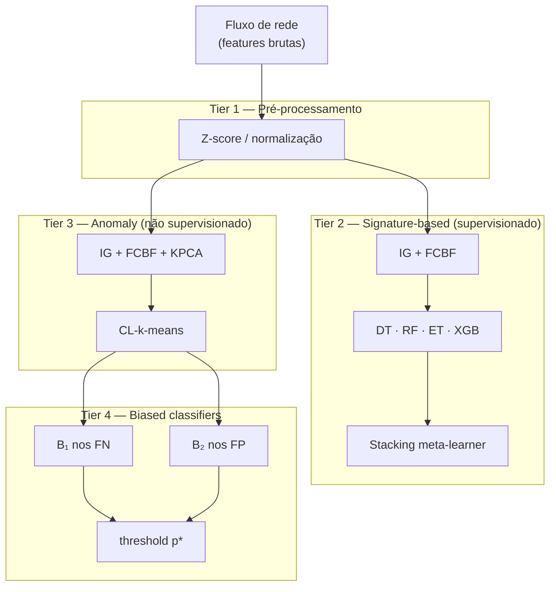
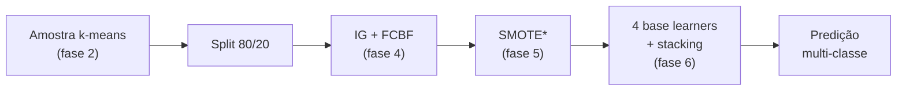
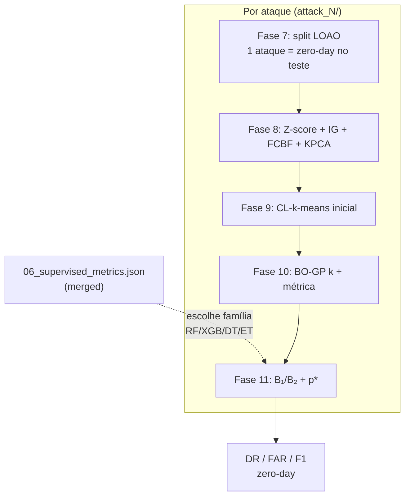
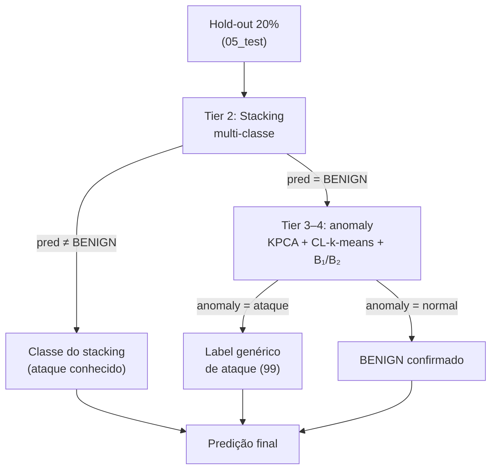

# Documentação do projeto

Índice da documentação do repositório [Intrusion-Detection-System-Using-Machine-Learning](../README.md), com foco no pacote modular **`mth_ids_pipeline`** — reprodução do método **MTH-IDS** (Yang et al., IEEE IoT Journal 2022).

A documentação está em **português**. O [README principal](../README.md) (inglês) traz contexto dos papers, citações e visão geral do repositório original IDS-ML.

---

## Por onde começar

| Se você quer… | Leia |
|---------------|------|
| Entender tiers, experimentos e pastas do código | [Arquitetura MTH-IDS](#arquitetura-mth-ids) (abaixo) ou [ARQUITETURA.md](ARQUITETURA.md) |
| Rodar o pipeline de ponta a ponta | [EXECUCAO.md](EXECUCAO.md) |
| Consultar uma fase específica (1–13) ou CLI manual | [PIPELINE_PHASES.md](PIPELINE_PHASES.md) |
| Comparar preset `paper` vs `notebook` | [PAPER_PROTOCOL.md](PAPER_PROTOCOL.md) |
| Escrever relatório sobre limitações artigo × código | [NOTA_REPRODUCAO.md](NOTA_REPRODUCAO.md) |
| Ver evidências da validação CICIDS2017 | [REPRODUCAO_CICIDS2017_VALIDACAO.md](REPRODUCAO_CICIDS2017_VALIDACAO.md) |

---

## Instalação e testes

Na raiz do repositório:

```powershell
python -m venv .venv
.venv\Scripts\activate
pip install -r requirements.txt
python -m pytest tests/ -q
```

- **Python:** 3.10+ (testado com 3.13)
- **Variáveis de ambiente:** nenhuma obrigatória; não há credenciais no pipeline
- **Dados:** colocar CSVs em `data/` conforme [data/README.md](../data/README.md) (pasta gitignored)

---

## Estrutura do repositório

| Pasta | Função |
|-------|--------|
| [`mth_ids_pipeline/`](../mth_ids_pipeline) | Código do pipeline (`core/`, `io/`, `phases/`, `orchestration/`, `utils/`) |
| [`docs/`](.) | Esta documentação |
| [`docs/figures/`](figures/) | Diagramas em texto (tiers e experimentos) |
| [`docs/archive/`](archive/README.md) | Relatórios históricos de auditoria |
| [`tests/`](../tests) | Testes automatizados (`pytest`) |
| [`paper_and_notebooks/`](../paper_and_notebooks) | Notebook IoTJ de referência + PDF do artigo |
| [`scripts/`](../scripts) | Scripts auxiliares fora do pacote |
| [`data/`](../data/README.md) | Datasets brutos e artefatos Parquet do pipeline |
| [`results/`](../results/README.md) | Logs e relatórios de execução (gerados localmente) |

---

## Arquitetura MTH-IDS

Referência: Yang et al., *MTH-IDS*, IEEE IoT Journal 2022.

Documentos relacionados: [EXECUCAO.md](EXECUCAO.md) · [PIPELINE_PHASES.md](PIPELINE_PHASES.md) · [PROTOCOLO_CICIDS.md](PROTOCOLO_CICIDS.md) · [PROTOCOLO_CAN.md](PROTOCOLO_CAN.md) · [PAPER_PROTOCOL.md](PAPER_PROTOCOL.md)

### 4 tiers do método

| Tier | Componente | Fases |
|------|------------|-------|
| **1** | Z-score / normalização | 1 (+ scaler na 4/8) |
| **2** | IG + FCBF + DT/RF/ET/XGB + stacking | 4–6 |
| **3** | IG + FCBF + KPCA + CL-k-means | 8–10 |
| **4** | Biased B₁/B₂ + threshold p* | 11 |



### 3 experimentos

| Experimento | Tiers | Tabela CICIDS | Tabela CAN | Script |
|-------------|-------|---------------|------------|--------|
| **Supervisionado** | 1–2 | VII | VI | `run_supervised` |
| **LOAO / zero-day** | 3–4 (+ família tier 2 p/ biased) | IX | VIII | `run_anomaly --loao` |
| **Sistema completo** | 1–2–3–4 (cascata) | X | X | `run_global_anomaly` + `run_eval` |

| | Supervisionado | LOAO | Sistema completo |
|---|----------------|------|------------------|
| Classificação | Multi-classe | Binária | Multi-classe + fallback anomaly |
| Modelos anomaly | — | **1 por zero-day** | **1 global** + stacking |
| Teste | Hold-out 20% | Slice do ataque zero-day | Hold-out 20% (cascata) |

**LOAO:** cada `attack_N/` roda fases 7–11 de forma independente — **não** é a cascata da Tabela X.

**Tabela X:** stacking classifica; se BENIGN → anomaly global (`core/inference.py`). Treino anomaly em `anomaly/global/`; avaliação na fase 13.

#### Experimento 1 — Supervisionado (Tabela VII / VI)



\*SMOTE aplicado no CICIDS; omitido no CAN.

#### Experimento 2 — LOAO / zero-day (Tabela IX / VIII)



#### Experimento 3 — Sistema completo / cascata (Tabela X)



### Perfis de rótulo e pastas

| Perfil | CSV CICIDS | Classes | Pasta | Usado em |
|--------|------------|---------|-------|----------|
| `merged` | `CICIDS2017.csv` | 7 famílias | `pipeline_mth_ids_merged/` | VII, X |
| `fine` | `CICIDS2017_fine.csv` | ~15 subtipos | `pipeline_mth_ids_fine/` | IX (LOAO) |
| `can_merged` | `CAN_OTIDS_Dataset.csv` (Car-Hacking ou OTIDS) | 4 | `pipeline_can_otids_merged/` | VI, X |
| `can_fine` | mesmo CSV | 4 LOAO (intrusion) / 3 (OTIDS) | `pipeline_can_otids_fine/` | VIII |

**Regra:** VII/VI e X → **merged** (`can_merged`). IX/VIII → **fine** (`can_fine`).

LOAO e global são ramos **diferentes** — rodar um não substitui o outro. Detalhes e comandos: [EXECUCAO.md](EXECUCAO.md).

### Layout do pacote

```
mth_ids_pipeline/
├── config.py, protocol.py, label_profiles.py, cli.py
├── run_supervised.py      # fases 1–6
├── run_anomaly.py         # fases 7–12 (LOAO)
├── run_global_anomaly.py  # fases 7–11 global
├── run_eval.py            # fase 13
├── report_paper_tables.py
├── core/                  # ML (preprocessing, clustering, HPO, inference, …)
├── io/                    # anomaly_io, loao_reporting, run_log, …
├── phases/                # phase01 … phase13
├── orchestration/experiment_runner.py
└── utils/                 # merge_cicids, merge_can, bootstrap, FCBF
```

#### Ramos de execução

| Ramo | Fases | Perfil | Pasta padrão |
|------|-------|--------|--------------|
| Supervisionado CICIDS | 1–6 | `merged` | `pipeline_mth_ids_merged/` |
| LOAO CICIDS | 7–12 | `fine` | `pipeline_mth_ids_fine/` |
| Global + eval CICIDS | 7–11, 13 | `merged` | `…/anomaly/global/` |
| Supervisionado CAN | 1–6 | `can_merged` | `pipeline_can_otids_merged/` |
| LOAO CAN | 7–12 | `can_fine` | `pipeline_can_otids_fine/` |

Logs timestampados: `results/logs/`. LOAO: espelho em `results/logs/loao/attack_<N>.log`.

### CAN vs CICIDS

| Aspecto | CICIDS2017 | CAN |
|---------|------------|-----|
| Protocolo | `--protocol paper` | `--protocol can` |
| LOAO rodadas | ~14 | 3 (DoS, Fuzzy, Impersonation) |
| SMOTE | Sim (supervisionado + anomaly) | Não |
| Amostragem fase 2 | k-means 0,8% + minoritárias preservadas | k-means 0,8% em **todas** as classes |

Diagramas fonte (texto): [`docs/figures/`](figures/) (`01_quatro_tiers.txt` … `04_experimento3_cascata_tabela_x.txt`).

---

## Documentação técnica

### Núcleo do pipeline

| Documento | Conteúdo |
|-----------|----------|
| [ARQUITETURA.md](ARQUITETURA.md) | 4 tiers, 3 experimentos (supervisionado, LOAO, sistema completo), perfis `merged`/`fine`, layout do pacote |
| [EXECUCAO.md](EXECUCAO.md) | Comandos por tabela, pastas `data/` e `results/`, bootstrap automático, troubleshooting |
| [PIPELINE_PHASES.md](PIPELINE_PHASES.md) | Referência das fases 1–13 + [rodar cada fase manualmente](PIPELINE_PHASES.md#rodar-cada-fase-manualmente) |
| [PAPER_PROTOCOL.md](PAPER_PROTOCOL.md) | Diferenças entre `--protocol paper` e `--protocol notebook` |

### Protocolos por dataset

Cada protocolo descreve preparação dos dados, presets CLI, tabelas do artigo e uso de `report_paper_tables` (`--table vii` / `ix` / `x` / `all` — nomes legados do script).

| Documento | Dataset | Tabelas | Preset típico |
|-----------|---------|---------|---------------|
| [PROTOCOLO_CICIDS.md](PROTOCOLO_CICIDS.md) | CICIDS2017 (tráfego externo) | VII, IX, X | `--protocol paper` |
| [PROTOCOLO_CAN.md](PROTOCOLO_CAN.md) | CAN — índice geral | VI, VIII, X | `can` / `can_otids` |
| [PROTOCOLO_CAN_INTRUSION.md](PROTOCOLO_CAN_INTRUSION.md) | Car-Hacking original | VI, VIII, X | `--protocol can` + `merge_can --source original` |
| [PROTOCOLO_CAN_OTIDS.md](PROTOCOLO_CAN_OTIDS.md) | Repack OTIDS | VI, VIII, X | `--protocol can_otids` + `merge_can --source otids` |
| [PROTOCOLO_UNSW_NB15.md](PROTOCOLO_UNSW_NB15.md) | UNSW-NB15 | VII*, IX*, X* | `--protocol unsw` |
| [ADAPTACOES_UNSW_DESDE_CICIDS17.md](ADAPTACOES_UNSW_DESDE_CICIDS17.md) | — | Diferenças práticas CICIDS → UNSW | — |

\*No UNSW, os flags `vii`/`ix`/`x` do script são reutilizados; o relatório detecta o dataset pela pasta `pipeline_unsw_nb15_*`.

### Reprodução e relatórios

| Documento | Conteúdo |
|-----------|----------|
| [NOTA_REPRODUCAO.md](NOTA_REPRODUCAO.md) | Limitações e divergências artigo × notebook × preset `paper` (texto para defesa/relatório) |
| [REPRODUCAO_CICIDS2017_VALIDACAO.md](REPRODUCAO_CICIDS2017_VALIDACAO.md) | Validação da execução CICIDS2017 com links para artefatos em `results/cicids2017/` |
| [archive/README.md](archive/README.md) | Histórico de auditorias e refatorações |

---

## Início rápido por dataset

### CICIDS2017

```powershell
python -m mth_ids_pipeline.utils.merge_cicids --profile merged
python -m mth_ids_pipeline.utils.merge_cicids --profile fine

python -m mth_ids_pipeline.run_supervised --protocol paper          # Tabela VII
python -m mth_ids_pipeline.run_anomaly --protocol paper --loao      # Tabela IX
python -m mth_ids_pipeline.run_global_anomaly --protocol paper      # Tabela X (treino)
python -m mth_ids_pipeline.run_eval `
  --intermediate-dir data/pipeline_mth_ids_merged `
  --work-dir data/pipeline_mth_ids_merged/anomaly/global

python -m mth_ids_pipeline.report_paper_tables --table all `
  --merged-dir data/pipeline_mth_ids_merged `
  --loao-root data/pipeline_mth_ids_fine/anomaly/loao
```

Detalhes: [PROTOCOLO_CICIDS.md](PROTOCOLO_CICIDS.md) · [EXECUCAO.md](EXECUCAO.md)

### CAN (escolha **uma** fonte — não misturar)

```powershell
# Car-Hacking (artigo) → pipeline_can_intrusion_*
python -m mth_ids_pipeline.utils.merge_can --source original
python -m mth_ids_pipeline.run_supervised --protocol can
python -m mth_ids_pipeline.run_anomaly --protocol can --loao

# OTIDS → pipeline_can_otids_* (pastas separadas)
python -m mth_ids_pipeline.utils.merge_can --source otids
python -m mth_ids_pipeline.run_supervised --protocol can_otids
python -m mth_ids_pipeline.run_anomaly --protocol can_otids --loao
```

Detalhes: [PROTOCOLO_CAN.md](PROTOCOLO_CAN.md) · [PROTOCOLO_CAN_INTRUSION.md](PROTOCOLO_CAN_INTRUSION.md) · [PROTOCOLO_CAN_OTIDS.md](PROTOCOLO_CAN_OTIDS.md)

### UNSW-NB15

```powershell
# Pré-requisito: data/UNSW-NB15_merged.csv
python -m mth_ids_pipeline.run_supervised --protocol unsw
python -m mth_ids_pipeline.run_anomaly --protocol unsw --loao
```

Detalhes: [PROTOCOLO_UNSW_NB15.md](PROTOCOLO_UNSW_NB15.md) · [ADAPTACOES_UNSW_DESDE_CICIDS17.md](ADAPTACOES_UNSW_DESDE_CICIDS17.md)

---

## Pontos de entrada CLI

| Comando | Papel |
|---------|-------|
| `run_supervised` | Experimentos supervisionados (Tabela VII / VI) |
| `run_anomaly --loao` | Detecção zero-day por ataque (Tabela IX / VIII) |
| `run_global_anomaly` | Treino do modelo anomaly global (Tabela X) |
| `run_eval` | Avaliação do sistema completo (fase 13) |
| `run_all` | Orquestra fases por intervalo `--from` / `--to` |
| `report_paper_tables` | Compara métricas locais com valores do artigo/notebook |

Utilitários de dados: `merge_cicids`, `merge_can` (ver protocolos acima).

---

## Onde ficam os artefatos

| Tipo | Local padrão |
|------|----------------|
| Parquets e modelos do pipeline | `data/pipeline_<dataset>_<perfil>/` |
| Relatórios e logs de execução | `results/` (subpastas por dataset; ver [results/README.md](../results/README.md)) |
| Configs JSON por fase | `data/.../phase_reports/` ou cópias em `results/<dataset>/config/` |
| Snapshot versionado (validação) | `results/cicids2017/` (recorte mínimo; ver [REPRODUCAO_CICIDS2017_VALIDACAO.md](REPRODUCAO_CICIDS2017_VALIDACAO.md)) |

---

## Referências

- **Artigo MTH-IDS:** Yang et al., IEEE IoT Journal, 2022 — [PDF no repositório](../paper_and_notebooks/MTH_IDS_paper.pdf)
- **Notebook de referência:** [MTH_IDS_IoTJ.ipynb](../paper_and_notebooks/MTH_IDS_IoTJ.ipynb) (preset `notebook`)
- **Repositório upstream:** [Western-OC2-Lab/Intrusion-Detection-System-Using-Machine-Learning](https://github.com/Western-OC2-Lab/Intrusion-Detection-System-Using-Machine-Learning)
