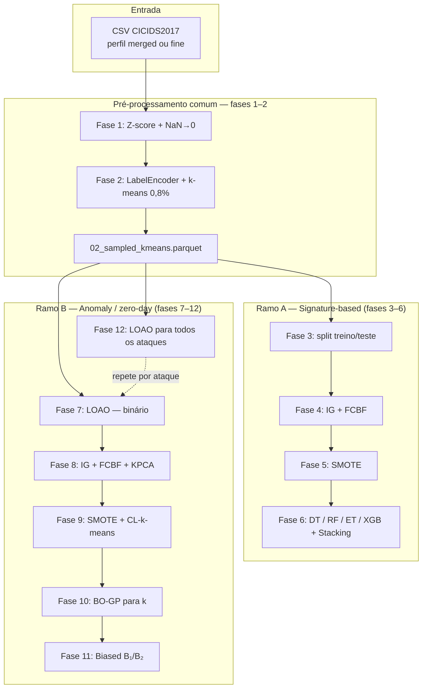

# Guia de arquitetura — Pipeline MTH-IDS

Este documento explica **como o método MTH-IDS está organizado neste repositório**: por que existem dois ramos de execução, o que significam “7 classes” vs “14 ataques”, e como usar os perfis de rótulos `merged` e `fine`.

**Referência:** L. Yang, A. Moubayed, A. Shami, *MTH-IDS: A Multi-Tiered Hybrid Intrusion Detection System for Internet of Vehicles*, IEEE IoT Journal, 2022.

**Documentação complementar:**

- [PIPELINE_PHASES.md](PIPELINE_PHASES.md) — detalhe operacional de cada fase (1–12)
- [METHODOLOGICAL_AUDIT.md](METHODOLOGICAL_AUDIT.md) — auditoria artigo × notebook × código
- Notebook oficial: [`paper_and_notebooks/MTH_IDS_IoTJ.ipynb`](../paper_and_notebooks/MTH_IDS_IoTJ.ipynb)

---

## 1. O que o MTH-IDS faz (em uma frase)

O MTH-IDS é um sistema **híbrido em camadas (tiers)** que combina:

1. **Detecção de ataques conhecidos** — classificadores supervisionados que distinguem o **tipo** de ataque (multi-classe).
2. **Detecção de ataques desconhecidos (zero-day)** — pipeline baseado em clustering (CL-k-means) e refinamento com classificadores enviesados, avaliado com **leave-one-attack-out (LOAO)**.

Os dois objetivos são **diferentes** e usam **tratamentos de rótulo diferentes**, mas compartilham o mesmo pré-processamento inicial sobre o CICIDS2017.

---

## 2. Um pipeline ou dois?

### Resposta curta

| Abordagem | Recomendação |
|-----------|--------------|
| Dois repositórios / dois pacotes Python separados | **Não** — duplica fases 1–2, config e risco de inconsistência nos rótulos |
| **Um pacote** (`mth_ids_pipeline`) com **dois ramos** após a fase 2 | **Sim** — é o desenho do artigo e o deste projeto |

### Diagrama geral



**Ponto de bifurcação:** o arquivo `02_sampled_kmeans.parquet`. A partir dele:

- o **ramo A** mantém rótulos **multi-classe**;
- o **ramo B** colapsa para **binário** (benigno vs malicioso) e segura **um** tipo de ataque como zero-day por experimento.

---

## 3. “7 classes” vs “14 ataques” — o mal-entendido mais comum

Muitas pessoas interpretam que um ramo usa **7 classes** e o outro **14 classes** no mesmo sentido (multi-classe). **Não é assim.**

| Conceito | Ramo supervisionado (3–6) | Ramo anomaly (7–12) |
|----------|---------------------------|------------------------|
| **Tipo de problema** | Classificação **multi-classe** | Classificação **binária** em cada rodada LOAO |
| **Rótulos por execução** | 0…N−1 (BENIGN + famílias/ataques) | Apenas **0** e **1** |
| **“7”** | ~7 classes no perfil **merged** (1 BENIGN + 6 ataques) | — |
| **“14”** | — | ~**14 experimentos** LOAO no artigo (Tabela IX), não 14 saídas do modelo |
| **No seu `loao_summary.json`** | — | `"n_attacks": 6` → **6 rodadas** LOAO (perfil merged com 6 famílias de ataque) |

### Analogia

- **Supervisionado:** “Este fluxo é DoS, PortScan ou BENIGN?” → várias respostas possíveis.
- **Anomaly (uma rodada LOAO):** “Este fluxo é benigno ou malicioso?” → duas respostas; repete-se segurando PortScan, depois DoS, depois Bot, etc.

O número **14** no artigo refere-se a **quantas vezes** se repete o experimento binário, cada vez com um subtipo de ataque **excluído do treino** (zero-day), quando se usam os **rótulos originais** do CICIDS2017 sem agrupar famílias.

---

## 4. Perfis de rótulos: `merged` e `fine`

O repositório suporta dois **perfis de entrada**, definidos em `mth_ids_pipeline/label_profiles.py`:

| Perfil | Arquivo CSV | Pasta de artefatos | Uso típico |
|--------|-------------|-------------------|------------|
| **merged** | `data/CICIDS2017.csv` | `data/pipeline_mth_ids_merged/` | Notebook oficial, Tabela VII (multi-classe), LOAO com **6** famílias |
| **fine** | `data/CICIDS2017_fine.csv` | `data/pipeline_mth_ids_fine/` | Tabela IX do artigo, LOAO com **~14** tipos de ataque |

### O que o perfil `merged` faz

Agrupa subtipos do CICIDS2017 em **famílias** (como no notebook):

| Subtipos originais (exemplos) | Família |
|------------------------------|---------|
| DoS Hulk, GoldenEye, slowloris, DDoS, Heartbleed, … | **DoS** |
| FTP-Patator, SSH-Patator | **BruteForce** |
| Web Attack (Brute Force, XSS, Sql Injection) | **WebAttack** |

Resultado típico após o merge:

- BENIGN  
- DoS, PortScan, BruteForce, WebAttack, Bot, Infiltration  

→ **7 rótulos** no total → **6 ataques** para LOAO.

### O que o perfil `fine` faz

**Não** aplica o agrupamento acima. Mantém os rótulos **como vêm** dos CSV em `data/MachineLearningCSV/`.

→ cerca de **14 tipos de ataque** + BENIGN → **~14 rodadas** LOAO na fase 12.

### Artefatos que você já gerou

Se você rodou o pipeline em `data/pipeline_mth_ids_full/` com um CSV já agrupado, isso equivale ao perfil **merged**. Para reutilizar:

```powershell
python -m mth_ids_pipeline.run_supervised --label-profile merged `
  --intermediate-dir data/pipeline_mth_ids_full
```

Não misture parquets de perfis diferentes no mesmo `--intermediate-dir`.

---

## 5. Como os rótulos mudam em cada ramo

### 5.1 Fase 2 (comum)

1. `LabelEncoder` transforma strings em inteiros (ordem alfabética → **BENIGN = 0** no CICIDS2017).
2. Amostragem k-means: classe majoritária (BENIGN) é subamostrada; classes de ataque raras podem ser preservadas inteiras.

| Perfil | Parâmetro na fase 2 |
|--------|---------------------|
| **merged** | `--minority-labels 6,1,4` (Bot, Infiltration, WebAttack no encoding do notebook) |
| **fine** | `--auto-minority` (todos os rótulos ≠ 0 preservados) |

### 5.2 Ramo supervisionado (fases 3–6)

Os inteiros da fase 2 **permanecem**. O modelo aprende a prever **cada classe de ataque separadamente**.

Exemplo (perfil merged, após encoding):

| Inteiro | Significado |
|---------|-------------|
| 0 | BENIGN |
| 1 | Bot |
| 2 | BruteForce |
| 3 | DoS |
| 4 | Infiltration |
| 5 | PortScan |
| 6 | WebAttack |

Consulte sempre `phase_reports/phase02_sample_kmeans.json` após a fase 2 para o mapeamento exato no seu CSV.

### 5.3 Ramo anomaly — fase 7 (LOAO, um ataque por vez)

Para um ataque escolhido como **zero-day** (ex.: PortScan = 5):

**Conjunto de treino (`df1`)** — todos os fluxos **exceto** o zero-day:

- BENIGN → **0**
- qualquer outro ataque → **1** (todos os tipos conhecidos viram uma única classe “malicioso”)

**Conjunto de teste (`df2`)** — **somente** o ataque segurado:

- todos os fluxos → **1**

Depois, o pipeline mistura benignos amostrados de `df1` em `df2` (fase 8), aplica KPCA, CL-k-means, etc. — sempre em espaço **binário** para aquela rodada.

A fase **12** repete fases 7→8→9→10→11 para **cada** rótulo de ataque presente na amostra.

---

## 6. Tiers do artigo vs fases do pipeline

| Tier (artigo) | Nome | Fases neste repo |
|---------------|------|------------------|
| 1 | Classificadores base (DT, RF, ET, XGB) | 6 |
| 2 | Stacking | 6 |
| 3 | CL-k-means | 9, 10 |
| 4 | Biased classifiers B₁/B₂ + limiar p* | 11 |

| Objetivo | Ramo | Fases |
|----------|------|-------|
| Ataques **conhecidos** (signature) | Supervisionado | 1–6 |
| Um zero-day (demo notebook) | Anomaly | 7–11 |
| Todos os zero-days (Tabela IX) | LOAO | 12 |

---

## 7. Comandos práticos

### 7.1 Gerar os CSVs de entrada

Coloque os arquivos brutos em `data/MachineLearningCSV/`, depois:

```powershell
python -m mth_ids_pipeline.utils.merge_cicids --profile merged
python -m mth_ids_pipeline.utils.merge_cicids --profile fine
```

### 7.2 Perfil merged (Tabela VII — padrão supervisionado)

```powershell
python -m mth_ids_pipeline.run_supervised --label-profile merged
```

### 7.3 Perfil fine (Tabela IX — padrão do `run_anomaly`)

```powershell
python -m mth_ids_pipeline.run_supervised --label-profile fine --from 1 --to 2
python -m mth_ids_pipeline.run_anomaly --loao
```

### 7.4 Orquestrador genérico

```powershell
python -m mth_ids_pipeline.experiment_runner --label-profile merged --from 1 --to 6
python -m mth_ids_pipeline.experiment_runner --label-profile fine --run-loao --from 12 --to 12
```

---

## 8. Perguntas frequentes

### Preciso de dois pipelines de código?

**Não.** Um pacote, dois ramos de execução, opcionalmente dois perfis de CSV (`merged` / `fine`).

### Posso rodar `--from 1 --to 12` de uma vez?

Tecnicamente sim, mas **não é recomendado** para análise: os ramos têm objetivos e métricas distintas. Rode **1–2** (comum), depois **3–6** ou **7–12** conforme o experimento.

### O ramo anomaly é “não supervisionado”?

**Parcialmente.** Usa labels binários no treino, SMOTE e cluster labeling (semi-supervisionado). “Anomaly” no artigo significa **zero-day**, não ausência total de rótulos.

### Por que meu LOAO tem 6 ataques e o artigo fala em 14?

Porque seu CSV usa **famílias agregadas** (perfil merged). Para ~14 rodadas, gere `CICIDS2017_fine.csv` e use `--label-profile fine`.

### A fase 6 e a fase 11 estão ligadas?

**Sim.** A fase 11 pode reutilizar a **melhor família** de classificador treinada na fase 6 (XGB, RF, etc.) para os biased classifiers do tier 4.

### O que nunca fazer?

- Passar dados **binários** da fase 7 para as fases 3–6.  
- Misturar artefatos `merged` e `fine` no mesmo `--intermediate-dir`.  
- Interpretar “14” como 14 classes no classificador do ramo anomaly.

---

## 9. Estrutura de pastas por perfil

```
data/
├── CICIDS2017.csv              # merged
├── CICIDS2017_fine.csv         # fine
├── pipeline_mth_ids_merged/    # artefatos merged
│   ├── 01_preprocessed.parquet
│   ├── 02_sampled_kmeans.parquet
│   ├── 03_train.parquet … 06_supervised_metrics.json
│   ├── anomaly/
│   │   └── loao/
│   │       ├── attack_1/ …
│   │       └── loao_summary.json
│   └── phase_reports/
├── pipeline_mth_ids_fine/      # artefatos fine (mesma árvore)
└── pipeline_mth_ids_full/      # execuções suas anteriores (≈ merged)
```

---

## 10. Resumo visual

```
                    CICIDS2017
                         │
            ┌────────────┴────────────┐
            │                         │
      perfil merged              perfil fine
      (~7 rótulos)              (~15 rótulos)
            │                         │
            └────────────┬────────────┘
                         │
                  Fases 1–2 (comum)
                         │
              02_sampled_kmeans.parquet
                         │
         ┌───────────────┴───────────────┐
         │                               │
   Fases 3–6                        Fases 7–12
   MULTI-CLASSE                     BINÁRIO + LOAO
   "qual ataque?"                   "benigno ou ataque?"
   Tabela VII                      Tabela IX
   6–7 classes                     6 ou ~14 rodadas
```

---

## 11. Referência rápida de módulos

| Módulo | Função |
|--------|--------|
| `label_profiles.py` | Definição merged/fine, merge de famílias, auto-minority |
| `utils/merge_cicids.py` | Geração dos CSV a partir de `MachineLearningCSV/` |
| `run_supervised.py` | Atalho fases 1–6 |
| `run_anomaly.py` | Atalho fases 7–11 ou `--loao` (fase 12) |
| `experiment_runner.py` | Orquestrador com `--label-profile` |
| `anomaly_io.py` | Split binário LOAO (`build_anomaly_binary_split`) |

---

*Documento gerado para o repositório Intrusion-Detection-System-Using-Machine-Learning. Última atualização alinhada aos perfis `merged` / `fine` e aos wrappers `run_supervised` / `run_anomaly`.*
