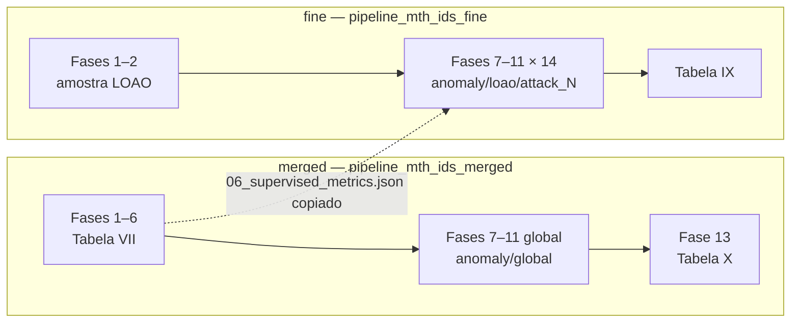

# Merged vs fine — perfis, tabelas e comandos

Guia de referência para entender **qual perfil de rótulo** (`merged` ou `fine`) usar em cada experimento do artigo MTH-IDS (Yang et al., IEEE IoT Journal 2022) e **quais comandos** rodar em cada caso.

**Guia passo a passo:** [COMO_RODAR_TABELAS.md](COMO_RODAR_TABELAS.md)

Documentos relacionados: [PAPER_PROTOCOL.md](PAPER_PROTOCOL.md) · [PASTAS_E_BOOTSTRAP.md](PASTAS_E_BOOTSTRAP.md) · [PIPELINE_PHASES.md](PIPELINE_PHASES.md)

---

## Resumo em uma tabela

| Experimento | Tabela / figura | Perfil | Pasta | Detector anomaly | Comando principal |
|-------------|-----------------|--------|-------|------------------|-------------------|
| Supervisionado (ataques conhecidos) | **VII** | **merged** | `pipeline_mth_ids_merged` | — | `run_supervised` |
| Zero-day LOAO (um ataque por vez) | **IX** | **fine** | `pipeline_mth_ids_fine/anomaly/loao` | 14 modelos (1 por ataque) | `run_anomaly --loao` |
| Sistema completo (cascata tiers 1→4) | **X** (+ figs. 4–5) | **merged** | `pipeline_mth_ids_merged/anomaly/global` | **1 modelo global** | `run_global_anomaly` + `run_eval` |

**Regra prática:** se o objetivo é **Tabela X** ou **supervisionado**, use **merged**. Se o objetivo é **LOAO / Tabela IX**, use **fine**.

---

## O que é `merged` e o que é `fine`?

Ambos partem do mesmo CICIDS2017 bruto (`data/MachineLearningCSV/`), mas o CSV gerado e o número de classes diferem:

| | **merged** | **fine** |
|---|------------|----------|
| CSV | `data/CICIDS2017.csv` | `data/CICIDS2017_fine.csv` |
| Geração | `merge_cicids --profile merged` | `merge_cicids --profile fine` |
| Rótulos | **7** — BENIGN + 6 famílias agregadas | **~15** — subtipos originais do dataset |
| Exemplo de agregação | DoS Hulk, DDoS, GoldenEye… → **DoS** | Cada subtipo permanece separado |
| Pasta de artefatos | `data/pipeline_mth_ids_merged/` | `data/pipeline_mth_ids_fine/` |
| Fase 2 (minoritárias) | Bot, Infiltration, WebAttack (merged) | Bot, Infiltration, WebAttack **fine** + Heartbleed |

### Como reconhecer pelo `value_counts` da fase 2

**Merged** — tipicamente **7 rótulos** após `LabelEncoder`:

```
0    18117   # BENIGN
3     3078   # DoS (família)
6     2180   # WebAttack
1     1966   # Bot
5     1291   # PortScan
2      123   # BruteForce
4       36   # Infiltration
```

**Fine** — tipicamente **~15 rótulos** (DDoS, DoS Hulk, PortScan, Web Attack XSS, etc. separados).

---

## Três experimentos distintos no artigo



### Tabela VII — supervisionado (merged)

- **Objetivo:** classificar ataques **conhecidos** (tiers 1–2: base learners + stacking).
- **Split:** 80% treino / 20% hold-out.
- **Não usa** perfil fine.

```powershell
python -m mth_ids_pipeline.utils.merge_cicids --profile merged
python -m mth_ids_pipeline.run_supervised --protocol paper
python -m mth_ids_pipeline.report_paper_tables --table vii `
  --merged-dir data/pipeline_mth_ids_merged
```

### Tabela IX — LOAO (fine)

- **Objetivo:** simular **zero-day** — em cada rodada, **um** tipo de ataque fica fora do treino e entra só no teste.
- **14 rodadas** (`attack_1` … `attack_14`), cada uma com fases 7–11 próprias.
- **Não é** o mesmo que Tabela X: aqui há **um detector por ataque**, não um detector global.

```powershell
python -m mth_ids_pipeline.utils.merge_cicids --profile fine
python -m mth_ids_pipeline.run_anomaly --protocol paper --loao
python -m mth_ids_pipeline.report_paper_tables --table ix `
  --loao-root data/pipeline_mth_ids_fine/anomaly/loao
```

**Bootstrap automático** (`run_anomaly`):
- Gera `02_sampled_kmeans.parquet` no **fine** (fases 1–2).
- Garante `06_supervised_metrics.json` no **merged** (fases 4–6) e **copia** para o fine (fase 11 biased).

### Tabela X — sistema completo (merged)

- **Objetivo:** avaliar a **cascata inteira** no hold-out: Z-score → Stacking (tier 2) → se “Normal”, KPCA + CL-k-means + B₁/B₂ (tiers 3–4).
- **Um único** detector anomaly **global** (binário benigno vs ataque), treinado em `anomaly/global/`.
- **Não usa** `pipeline_mth_ids_fine` nem pastas `attack_*` do LOAO.

**Pré-requisitos (ordem obrigatória):**

| # | O quê | Onde |
|---|--------|------|
| 1 | Fases 1–2 (amostra k-means) | `pipeline_mth_ids_merged` |
| 2 | Fases 4–6 (modelos supervisionados + `06_supervised_metrics.json`) | `pipeline_mth_ids_merged` |
| 3 | Fases 7–11 modo `--mode global` | `pipeline_mth_ids_merged/anomaly/global` |
| 4 | Fase 13 (inferência cascata + CM) | `run_eval` |

```powershell
# Pré-requisitos
python -m mth_ids_pipeline.run_supervised --protocol paper --from 1 --to 2
python -m mth_ids_pipeline.run_supervised --protocol paper --from 4 --to 6

# Tabela X
python -m mth_ids_pipeline.run_global_anomaly --protocol paper
python -m mth_ids_pipeline.run_eval `
  --intermediate-dir data/pipeline_mth_ids_merged `
  --work-dir data/pipeline_mth_ids_merged/anomaly/global
python -m mth_ids_pipeline.report_paper_tables --table x `
  --merged-dir data/pipeline_mth_ids_merged
```

**Comparativo completo** (VII + IX + X):

```powershell
python -m mth_ids_pipeline.report_paper_tables --table all `
  --merged-dir data/pipeline_mth_ids_merged `
  --loao-root data/pipeline_mth_ids_fine/anomaly/loao
```

Grava automaticamente em `results/paper_comparison.json` e `results/tables_report.txt`.

---

## LOAO vs detector global — diferença central

| | **LOAO (Tabela IX)** | **Global (Tabela X)** |
|---|----------------------|------------------------|
| Perfil | fine | merged |
| Quantos modelos anomaly | **14** (um por zero-day) | **1** (todos os ataques juntos) |
| Partição fase 7 | Exclui **um** ataque do treino | Treino binário no 80%; hold-out 20% para fase 13 |
| Pasta de trabalho | `anomaly/loao/attack_<N>/` | `anomaly/global/` |
| Métrica agregada | Média F1/DR/FAR sobre 14 ataques | Acc/DR/FAR/F1 no hold-out completo |
| Usa stacking tier 2? | Não (só ramo anomaly) | Sim — cascata completa na fase 13 |

Rodar `run_global_anomaly` **não** substitui LOAO. Rodar LOAO **não** gera Tabela X.

---

## Mapa de pastas (atualizado)

```
results/                        # tabelas exportadas (fora de data/)
├── paper_comparison.json
└── tables_report.txt

data/
├── CICIDS2017.csv              # merged (7 classes)
├── CICIDS2017_fine.csv         # fine (~15 classes)
│
├── pipeline_mth_ids_merged/    # Tabela VII + Tabela X (treino)
│   ├── 01_preprocessed.parquet
│   ├── 02_sampled_kmeans.parquet
│   ├── 06_supervised_metrics.json
│   ├── anomaly/
│   │   └── global/             # fases 7–11 (modo global)
│   │       ├── a04_after_kpca.parquet
│   │       ├── reports/phase07…phase11.json
│   │       └── (modelos persistidos: b1, b2, cl-kmeans, …)
│   ├── phase_reports/
│   │   └── phase13_full_system_eval.json   # Tabela X
│   └── figures/
│       ├── fig_multiclass_cm.png
│       └── fig_binary_cm.png
│
└── pipeline_mth_ids_fine/      # Tabela IX (LOAO)
    ├── 01_preprocessed.parquet
    ├── 02_sampled_kmeans.parquet
    ├── 06_supervised_metrics.json   # cópia do merged
    └── anomaly/
        └── loao/
            ├── attack_1/ … attack_14/
            └── loao_summary.json
```

---

## Erros comuns

| Sintoma | Causa | Solução |
|---------|-------|---------|
| `02_sampled_kmeans.parquet` não encontrado ao rodar `run_global_anomaly` | Fases 1–2 **merged** não concluídas | `run_supervised --from 1 --to 2` no merged |
| `run_eval` / fase 13 falha sem modelos | Fases 4–6 ou 7–11 incompletas | Completar cadeia merged antes do eval |
| Confundir LOAO com Tabela X | Pastas e protocolos diferentes | LOAO = fine/`attack_*`; Tabela X = merged/`global` |
| `run_supervised --label-profile fine` grava no merged | `run_supervised` força `intermediate-dir` merged | Use `run_all --label-profile fine` ou `--intermediate-dir data/pipeline_mth_ids_fine` |
| Comparar Tabela X com split 70/30 do artigo | Pipeline usa **80/20** por padrão | Comparativo é aproximado; ver nota em `report_paper_tables --table x` |

---

## Scripts de entrada (referência)

| Script | Perfil default | Fases | Tabela |
|--------|----------------|-------|--------|
| `run_supervised` | merged | 1–6 | VII |
| `run_anomaly --loao` | fine | 7–12 | IX |
| `run_global_anomaly` | merged | 7–11 (global) | X (pré-requisito) |
| `run_eval` | merged (via `--intermediate-dir`) | 13 | X |
| `report_paper_tables` | — | — | VII / IX / X → `results/` |

---

## Refazer fases 1–2 do zero (ambos os perfis)

```powershell
# Regenerar CSVs
python -m mth_ids_pipeline.utils.merge_cicids --profile merged
python -m mth_ids_pipeline.utils.merge_cicids --profile fine

# Merged (Tabela VII / X)
Remove-Item data/pipeline_mth_ids_merged/01_preprocessed.parquet -ErrorAction SilentlyContinue
Remove-Item data/pipeline_mth_ids_merged/02_sampled_kmeans.parquet -ErrorAction SilentlyContinue
python -m mth_ids_pipeline.run_supervised --protocol paper --from 1 --to 2

# Fine (Tabela IX / LOAO)
Remove-Item data/pipeline_mth_ids_fine/01_preprocessed.parquet -ErrorAction SilentlyContinue
Remove-Item data/pipeline_mth_ids_fine/02_sampled_kmeans.parquet -ErrorAction SilentlyContinue
python -m mth_ids_pipeline.run_all --label-profile fine --protocol paper --from 1 --to 2
```

A fase 2 (k-means em ~2,8M linhas) pode levar **dezenas de minutos** por perfil.
