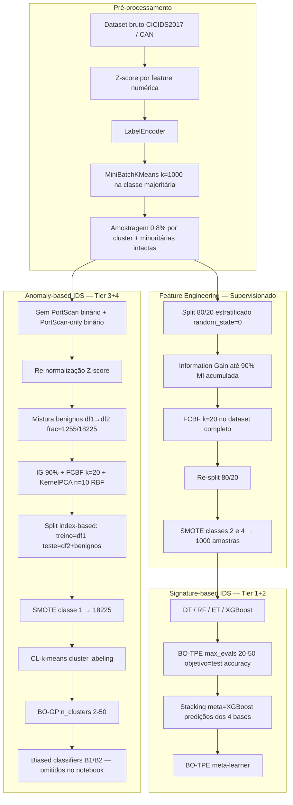

# Auditoria Metodológica — MTH-IDS (Yang et al., IEEE IoT Journal 2022)

Documento preparado **antes** de alterações metodológicas. Classificação por etapa:
- **Confirmada** — descrita explicitamente no artigo e/ou implementada no notebook
- **Inferida** — deduzida do código ou prática comum, não totalmente especificada
- **Ausente/Ambígua** — omitida, contraditória ou parcialmente publicada

---

## 1. Fluxograma completo do método

---

## 2. Dataset utilizado

| Aspecto | Artigo | Notebook | Pipeline |
|---------|--------|----------|----------|
| Externo | CICIDS2017 completo (~2.8M fluxos, 80 features) | `./data/CICIDS2017.csv` ou amostra `CICIDS2017_sample_km.csv` | Configurável via `--raw-csv` |
| Intra-veicular | CAN-intrusion-dataset | Mencionado, não executado no notebook | `utils/merge_can.py` |
| Amostragem | k-means cluster sampling 0.8% | **Confirmada** | **Confirmada** |
| Validação externa | 10-fold CV (Tabela VII) | Hold-out 20% estratificado | Hold-out 20% (**diverge do artigo**) |

**Classificação:** amostragem **Confirmada**; protocolo de validação **Ausente/Ambígua** (artigo vs notebook).

---

## 3. Pré-processamentos

| Etapa | Parâmetros | Classificação |
|-------|------------|---------------|
| Z-score | `(x - mean) / std` por coluna numérica | **Confirmada** |
| NaN → 0 | `fillna(0)` | **Confirmada** (notebook) |
| Label encoding | `LabelEncoder` ordem alfabética | **Confirmada** |
| Remoção timestamp CAN | Removido no artigo | **Confirmada** (CAN only) |

---

## 4. Balanceamento de classes

| Ramo | Método | Parâmetros | Classificação |
|------|--------|------------|---------------|
| Supervisionado | SMOTE | `{2:1000, 4:1000}` (BruteForce, Infiltration) | **Confirmada** |
| Anomaly | SMOTE | `{1:18225}` | **Confirmada** (notebook) |

---

## 5. Seleção de atributos

| Método | Parâmetro | Onde aplicado | Classificação |
|--------|-----------|---------------|---------------|
| Information Gain (MI) | α = 0.9 acumulado | Treino (supervisionado) / dataset completo (anomaly) | **Confirmada** (α); escopo **Inferida** no anomaly |
| FCBF (FCBFK) | k = 20 | Após IG | **Confirmada** |
| Otimização α via BO-GP | Artigo menciona para CAN | Notebook fixa 0.9 | **Ausente/Ambígua** no notebook |

---

## 6. Redução de dimensionalidade

| Método | Parâmetros | Ramo | Classificação |
|--------|------------|------|---------------|
| Kernel PCA | n_components=10, kernel=rbf | Anomaly only | **Confirmada** (notebook) |
| Otimização KPCA via BO-GP | Artigo | Notebook fixo | **Ausente/Ambígua** |

---

## 7. Algoritmos utilizados

### Signature-based (Tier 1)
- Decision Tree, Random Forest, Extra Trees, XGBoost — **Confirmada**

### Signature-based (Tier 2)
- Stacking com meta-learner XGBoost — **Confirmada**
- BO-TPE (Hyperopt) — **Confirmada**

### Anomaly-based (Tier 3)
- CL-k-means (MiniBatchKMeans + cluster labeling) — **Confirmada**

### Anomaly-based (Tier 4)
- Dois biased classifiers (B1 FP, B2 FN) + threshold p*=0.933 — **Confirmada** (artigo), **Ausente** (notebook ~5% omitido)

---

## 8. Estratégia de validação

| Componente | Artigo | Notebook/Pipeline |
|------------|--------|-------------------|
| Known attacks CICIDS2017 | 10-fold CV | Hold-out 20% estratificado |
| Unknown attacks | Leave-one-attack-out + benignos emparelhados | PortScan como zero-day + benignos amostrados |
| HPO objetivo | Validation accuracy (artigo) | **Test set accuracy** (notebook) |
| Biased classifiers | Hold-out nos incertos | Não implementado |

**Classificação:** validação known attacks **Ausente/Ambígua**; HPO no test set **Confirmada** (notebook), **Inferida** como divergência do artigo.

---

## 9. Métricas reportadas

| Métrica | Artigo | Notebook |
|---------|--------|----------|
| Accuracy (Acc) | Sim (%) | Sim |
| Detection Rate (DR) | Sim | Não calculada explicitamente |
| False Alarm Rate (FAR) | Sim | Não calculada explicitamente |
| F1-score | Sim (macro/binário e multi-class) | Weighted F1 (sklearn) |
| Execution time | Sim | Não |
| Confusion matrix | Implícita | Sim (heatmap) |

---

## 10. Otimização de hiperparâmetros

### BO-TPE (supervisionado)
| Modelo | max_evals | Espaço | Classificação |
|--------|-----------|--------|---------------|
| XGBoost | 20 | n_estimators 10-100, max_depth 4-100, lr ~ N(0.01,0.9) | **Confirmada** |
| RF / ET | 20 | n_estimators, max_depth, max_features, min_samples_*, criterion | **Confirmada** |
| DT | 50 | idem sem n_estimators | **Confirmada** |
| Stacking meta | 20 | igual XGBoost | **Confirmada** |

### BO-GP (anomaly)
| Parâmetro | n_calls | Espaço | Classificação |
|-----------|---------|--------|---------------|
| n_clusters | 20 | [2, 50] | **Confirmada** |
| p* threshold | BO-GP → 0.933 | — | **Confirmada** (artigo), **Ausente** (notebook) |

---

## 11. Variáveis aleatórias não controladas

| Componente | Seed no notebook | Impacto |
|------------|------------------|---------|
| train_test_split | 0 | Baixo |
| MiniBatchKMeans (sampling) | 0 | Baixo |
| RF/DT/ET | 0 | Baixo |
| XGBoost default | não explícito | Médio |
| Hyperopt fmin | não definido | **Alto** (ordem de trials) |
| SMOTE | não definido | Médio |
| KernelPCA | N/A | Médio-Alto |
| CL-k-means (anomaly) | não definido | **Alto** |
| Amostragem benignos PortScan | `random_state=None` | **Alto** |
| Biased classifiers | omitidos | N/A |

---

## 12. Possíveis causas de divergência de resultados

1. **Dataset:** artigo usa CICIDS2017 completo + 10-fold CV; notebook usa amostra ~27k + hold-out.
2. **Data leakage:** FCBF/IG no dataset completo antes do split final (fiel ao notebook, não ideal estatisticamente).
3. **HPO no test set:** infla métricas vs validação cruzada do artigo.
4. **Versões de bibliotecas:** sklearn, xgboost, imblearn evoluíram desde 2021.
5. **Componentes omitidos:** biased classifiers (~5% do código) explicam gap anomaly artigo (F1 médio 0.80) vs notebook PortScan-only (~0.94).
6. **Métricas diferentes:** artigo reporta DR/FAR/F1 macro; notebook usa weighted F1.
7. **Não-determinismo:** seeds ausentes em SMOTE, Hyperopt, CL-k-means anomaly.

---

## 13. Divergências artigo × notebook × implementação

| # | Tópico | Artigo | Notebook | Pipeline atual |
|---|--------|--------|----------|----------------|
| 1 | Validação supervisionada | 10-fold CV | Hold-out 20% | Hold-out 20% (fiel notebook) |
| 2 | HPO objetivo | Validation acc | Test acc | Test acc (fiel notebook) |
| 3 | α IG | BO-GP otimizado | Fixo 0.9 | Fixo 0.9 |
| 4 | KPCA params | BO-GP | Fixo n=10 RBF | Fixo n=10 RBF |
| 5 | Biased classifiers | Implementados | Omitidos | Omitidos |
| 6 | Anomaly validation | 14 leave-one-out attacks | PortScan demo | PortScan demo |
| 7 | Amostragem benignos | Emparelhamento 1:1 | frac 1255/18225 | `--benign-target 1255` |
| 8 | Formato intermediário | CSV | CSV | Parquet + JSON reports |

---

## 14. Hipóteses assumidas na reprodução

1. Reprodução **fiel ao notebook publicado**, não reimplementação idealizada do artigo.
2. Hiperparâmetros HPO fixos (`--no-hpo`) correspondem à **última execução salva** do notebook quando HPO não é reexecutado.
3. `random_state=0` aplicado onde o notebook define seed; demais componentes documentados como não-determinísticos.
4. Comparação com artigo usa Tabela VII (multi-class) com ressalva de protocolo diferente.
