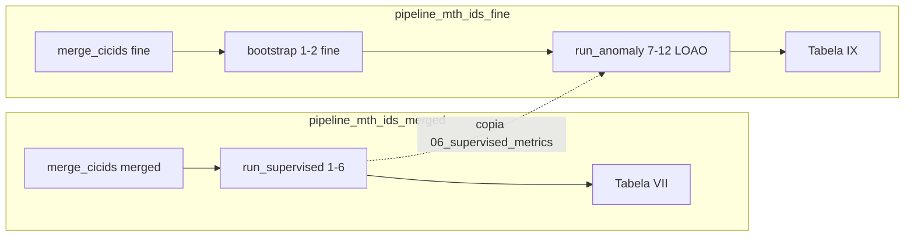

# Pastas separadas e bootstrap automático (MTH-IDS)

Este documento descreve como o pipeline modular separa os artefatos do **supervisionado** (Tabela VII) e do **anomaly LOAO** (Tabela IX), e como o ramo anomaly prepara os pré-requisitos sozinho.

Referências: [PAPER_PROTOCOL.md](PAPER_PROTOCOL.md), [GUIA_ARQUITETURA_MTH_IDS.md](GUIA_ARQUITETURA_MTH_IDS.md), artigo Yang et al. (IEEE IoT Journal 2022).

---

## Por que duas pastas?

O artigo usa o **mesmo dataset CICIDS2017** em dois experimentos distintos:

| Experimento | Rótulos | Objetivo |
|-------------|---------|----------|
| **Tabela VII** | 7 famílias agregadas (BENIGN + 6 ataques) | Ataques **conhecidos** (tiers 1–2) |
| **Tabela IX** | ~14 tipos de ataque originais | **Zero-day** — leave-one-attack-out (LOAO) |
| **Tabela X** | 7 famílias (merged) | **Sistema completo** — cascata tiers 1→4 no hold-out |

São **perfis de rótulo diferentes** (`merged` vs `fine`), gerados por `merge_cicids`, com **CSVs e parquets distintos**. Rodar fases 1–6 só no merged **não** alimenta o LOAO fine: a fase 7 lê `02_sampled_kmeans.parquet` do `--intermediate-dir` ativo.

**Tabela X também usa merged** (`anomaly/global/`), não fine. Guia completo: [MERGED_VS_FINE_E_TABELAS.md](MERGED_VS_FINE_E_TABELAS.md).

---

## Mapa de pastas (padrão paper)

| Pasta | Perfil | CSV de entrada | Comando principal |
|-------|--------|----------------|-------------------|
| `data/pipeline_mth_ids_merged/` | `merged` | `data/CICIDS2017.csv` | `run_supervised`, `run_global_anomaly`, `run_eval` |
| `data/pipeline_mth_ids_fine/` | `fine` | `data/CICIDS2017_fine.csv` | `run_anomaly` (`--loao`) |

Constantes em `mth_ids_pipeline/config.py`:

- `INTERMEDIATE_DIR_MERGED` → `data/pipeline_mth_ids_merged`
- `INTERMEDIATE_DIR_FINE` → `data/pipeline_mth_ids_fine`

---

## Layout de artefatos

### Supervisionado (`pipeline_mth_ids_merged`)

```
data/pipeline_mth_ids_merged/
├── 01_preprocessed.parquet
├── 02_sampled_kmeans.parquet      ← entrada fase 7 global (Tabela X)
├── 04_train_after_fcbf.parquet
├── 05_train_after_smote.parquet
├── 06_supervised_metrics.json     ← melhor modelo para biased (tier 4)
├── supervised_run.log             # run_supervised / experiment_runner (fases 1–6)
├── anomaly/
│   └── global/                    ← Tabela X: fases 7–11 (modo global, 1 detector)
│       ├── a04_after_kpca.parquet
│       └── reports/phase07…phase11.json
├── figures/                       ← CM fase 13 (fig_multiclass_cm, fig_binary_cm)
└── phase_reports/
    └── phase13_full_system_eval.json
```

### Anomaly / LOAO (`pipeline_mth_ids_fine`)

```
data/pipeline_mth_ids_fine/
├── 01_preprocessed.parquet          # bootstrap fases 1–2 (fine)
├── 02_sampled_kmeans.parquet        # obrigatório antes da fase 7
├── 06_supervised_metrics.json       # cópia da Tabela VII (merged); fase 11 biased
├── supervised_run.log               # bootstrap fases 1–2 (fine) via experiment_runner
├── anomaly/                         # demo fases 7–11 (opcional)
│   └── loao/                        # fase 12 — uma subpasta por ataque
│       ├── attack_1/
│       │   ├── loao_run.log          # só preenchido pela fase 12
│       │   ├── reports/              # phase07…phase11 JSON por ataque
│       │   ├── a04_after_kpca.parquet
│       │   └── a05_train_after_smote.parquet
│       ├── attack_2/
│       └── loao_summary.json         # agregado Tabela IX
└── phase_reports/
```

---

## Bootstrap automático

Implementado em `orchestration/experiment_runner.py` → `ensure_anomaly_prerequisites()`.

Ao executar **`run_anomaly`** (ou `experiment_runner` com ramo anomaly), **antes** das fases 7–12 o orquestrador verifica:

| Artefato | Onde é gerado | Usado em |
|----------|---------------|----------|
| `02_sampled_kmeans.parquet` | Fases **1–2** no **fine** (minoritárias = Bot/Infiltration/WebAttack fine; resto k-means 0,8%) | Fase 7 (partição LOAO) |
| `06_supervised_metrics.json` | Fases **4–6** no **merged** (Tabela VII) | Fase 11 (família do melhor learner para B1/B2) |

O `06_…` no fine é uma **cópia** do arquivo em `pipeline_mth_ids_merged` — alinhado ao artigo (tier 1–2 merged → tier 4 biased).

**Regras (perfil fine, padrão `run_anomaly`):**

1. Se **ambos** existem no fine → segue direto para as fases 7–12.
2. Se falta `02_…` → roda **fases 1–2** no `pipeline_mth_ids_fine` (amostragem estilo notebook; ver abaixo).
3. Se falta `06_…` no fine → garante Tabela VII no merged (fases **1–6** se necessário) e **copia** o JSON para o fine.

### Fase 2 no fine (escala ~notebook, alinhada ao merge)

No notebook **merged**, a amostra pós-k-means preserva **intactas** só as famílias do `df_minor`:

```python
df_minor = df[(df['Label']==6)|(df['Label']==1)|(df['Label']==4)]  # WebAttack, Bot, Infiltration
```

DoS, PortScan, BruteForce e BENIGN entram no k-means **0,8%**.

No perfil **fine**, o padrão do `run_anomaly` aplica a **mesma regra via merge** (`label_profiles.py`):

| Família merged (amostrada k-means) | Rótulos fine afetados |
|-----------------------------------|------------------------|
| DoS | DDoS, DoS Hulk, GoldenEye, slowloris, Slowhttptest, Heartbleed |
| BruteForce | FTP-Patator, SSH-Patator |
| PortScan | PortScan |
| BENIGN | BENIGN |

| Família merged (preservada inteira, = notebook `df_minor`) | Rótulos fine |
|------------------------------------------------------------|--------------|
| Bot | 1 |
| Infiltration | 9 |
| WebAttack | 12, 13, 14 |

Constante: `FINE_DEFAULT_MINORITY_LABELS` = `(1, 8, 9, 12, 13, 14)` — calculada por `compute_fine_minority_labels_notebook_aligned()` (Bot/Infiltration/WebAttack + Heartbleed ultra-raro).

#### Regra correta (não confundir com “não reduzidas pelo merge”)

A fase 2 **não** preserva “todos os rótulos fine que o merge não agrega”. O critério é espelhar o **`df_minor` do notebook merged** — famílias que entram **inteiras** na amostra pós-k-means.

| Conceito | O que significa |
|----------|-----------------|
| **Merge agregador** (`CICIDS_LABEL_MERGE`) | Vários subtipos fine → uma família merged (ex.: DoS Hulk + DDoS → **DoS**; Web Attack XSS → **WebAttack**) |
| **`df_minor` (notebook)** | Famílias **Bot**, **Infiltration**, **WebAttack** — preservadas intactas na fase 2 merged |
| **Regra fine** | Preservar inteiros os fine cujo destino merged ∈ `{Bot, Infiltration, WebAttack}` |

**Armadilha comum:** “preservar só classes que o merge não colapsou”. Isso incluiria **PortScan**, que no merged é 1:1 (não agregado), mas no notebook **não** está no `df_minor` — PortScan passa pelo k-means 0,8% igual DoS e BruteForce.

| Rótulo fine | Agregado pelo merge? | Família merged | Preservado na fase 2 fine? |
|-------------|----------------------|----------------|----------------------------|
| Bot (1) | Não | Bot | **Sim** (`df_minor`) |
| Infiltration (9) | Não | Infiltration | **Sim** (`df_minor`) |
| Web Attack 12, 13, 14 | **Sim** → WebAttack | WebAttack | **Sim** (`df_minor`) |
| PortScan (10) | Não | PortScan | **Não** (k-means 0,8%) |
| DoS Hulk, DDoS, … | Sim → DoS | DoS | **Não** (k-means 0,8%) |
| FTP/SSH-Patator | Sim → BruteForce | BruteForce | **Não** (k-means 0,8%) |
| BENIGN (0) | Não | BENIGN | **Não** (k-means 0,8%) |

Implementação: `merged_family_for_fine_label()` + `NOTEBOOK_MERGED_PRESERVED_FAMILIES` em `mth_ids_pipeline/label_profiles.py`.

Resultado típico: **~27k linhas** (próximo do merged `02_` e do `CICIDS2017_sample_km.csv`).

**Não** usa `--auto-minority` (14 ataques inteiros → ~576k).

Se já existir `02_` com política antiga, apague e regenere:

```powershell
Remove-Item data\pipeline_mth_ids_fine\02_sampled_kmeans.parquet
python -m mth_ids_pipeline.run_anomaly --protocol paper --loao
```

Mensagens no terminal:

```text
[anomaly] Bootstrap fases 1–2 (fine) em data/pipeline_mth_ids_fine ...
[anomaly] Tabela VII ausente: bootstrap fases 1–6 em data/pipeline_mth_ids_merged ...
[anomaly] 06_supervised_metrics.json ← .../pipeline_mth_ids_merged/... (Tabela VII → tier 4 biased)
```

### Desativar o bootstrap

```powershell
python -m mth_ids_pipeline.run_anomaly --protocol paper --loao --skip-bootstrap
```

Use apenas se já tiver `02_sampled_kmeans.parquet` no fine e `06_supervised_metrics.json` no fine (cópia do merged).

---

## Por que o bootstrap é assim? (decisão de design)

### Contexto no artigo MTH-IDS

Yang et al. (IEEE IoT Journal 2022) descreve **quatro tiers** de aprendizado. Os tiers **1–2** (signature-based) e **3–4** (anomaly-based) respondem a perguntas diferentes:

| Tier | Pergunta | Experimento no artigo |
|------|----------|------------------------|
| 1–2 | “Este fluxo é um dos **ataques conhecidos**?” | Tabela VII — 7 famílias agregadas (`merged`) |
| 3–4 | “Este fluxo é **anômalo** (zero-day)?” | Tabela IX — LOAO com ~14 tipos originais (`fine`) |

O LOAO **não** reutiliza o classificador multi-classe da Tabela VII. Ele treina **CL-k-means** (tier 3) e **biased classifiers** B₁/B₂ (tier 4) em um problema **binário** por rodada (benigno vs zero-day).

A ligação entre os dois experimentos é **pontual**: o tier 4 usa a **mesma família** de learner (RF, XGB, DT ou ET) que venceu no tier 1–2 — não os pesos do modelo, só o **tipo** de algoritmo.

### O que a fase 11 realmente consome

A fase 11 (`phase11_anomaly_biased`) lê `06_supervised_metrics.json` e escolhe o modelo com maior `f1_weighted`:

```python
best_model_name = pick_best_supervised_model(metrics_path)  # ex.: "RandomForest (HPO)"
factory = estimator_factory_for_supervised(best_model_name)  # B1/B2 treinados nessa família
```

Ou seja:

- **Não** carrega o modelo treinado na fase 6.
- **Não** usa features da fase 4 supervisionada (IG/FCBF multi-classe).
- **Só** decide se B₁/B₂ serão RF, XGB, DT ou ET — treinados no espaço **KPCA do LOAO** (fase 8).

No artigo, essa escolha vem do experimento **Tabela VII** (merged, 7 classes). Por isso `06_supervised_metrics.json` deve refletir o **merged**, não um re-treino no fine.

### Por que o bootstrap antigo estava errado

Versões anteriores do pipeline, ao faltar pré-requisitos no fine, rodavam **fases 4–6 inteiras no perfil fine** (~14 classes). Isso gerava três problemas metodológicos:

| Problema | Detalhe |
|----------|---------|
| **Granularidade errada** | Tabela VII = 7 famílias; re-treinar no fine = 14 rótulos originais → ranking de modelos diferente do artigo. |
| **SMOTE com IDs errados** | A fase 5 usa `{2: 1000, 4: 1000}` pensado para **merged** (2 = BruteForce, 4 = Infiltration). No **fine**, o `LabelEncoder` alfabético dá 2 = DDoS, 4 = DoS Hulk — classes totalmente diferentes. |
| **Custo desnecessário** | Re-executar HPO supervisionado (BO-GP α, BO-TPE, 10-fold CV) no fine não alimenta o LOAO; só atrasava o `run_anomaly --loao`. |

O LOAO em si (fases 7–12) **sempre** precisou de dados **fine** (`02_sampled_kmeans` com ~14 ataques). O erro era misturar isso com um supervisionado fine completo só para produzir um JSON de métricas.

### O que o bootstrap oficial faz hoje

```text
┌─────────────────────────────────────────────────────────────────┐
│  pipeline_mth_ids_fine                                          │
│  • fases 1–2  → 02_sampled_kmeans.parquet  (entrada LOAO)       │
│  • fases 7–12 → partição, KPCA, SMOTE binário, CL-k-means      │
│  • 06_…       → CÓPIA do merged (só para fase 11)             │
└─────────────────────────────────────────────────────────────────┘
                              ▲
                              │ shutil.copy2 (JSON apenas)
┌─────────────────────────────────────────────────────────────────┐
│  pipeline_mth_ids_merged                                        │
│  • fases 1–6  → Tabela VII (signature-based, 7 famílias)        │
│  • 06_supervised_metrics.json  → melhor learner tiers 1–2       │
└─────────────────────────────────────────────────────────────────┘
```

**Compartilhado:** um arquivo JSON (~KB) com nomes e métricas dos modelos.

**Não compartilhado:** parquets de treino (`04_…`, `05_…`), features supervisionadas, amostra k-means merged (rótulos diferentes).

### Implementação

Funções em `mth_ids_pipeline/orchestration/experiment_runner.py`:

| Função | Papel |
|--------|-------|
| `ensure_anomaly_prerequisites()` | Orquestra o bootstrap antes das fases 7–12 |
| `_bootstrap_supervised(1, 2)` | Amostra k-means no **fine** |
| `_ensure_merged_table_vii()` | Garante Tabela VII no **merged** (1–6 se ausente) |
| `_copy_supervised_metrics_for_biased()` | Copia `06_…` merged → fine |

Perfil **merged** no anomaly (demo notebook com `--label-profile merged`) mantém o comportamento legado: bootstrap 1–6 ou 4–6 **na mesma pasta**, porque LOAO e supervisionado compartilham o mesmo perfil de rótulos.

### Migração: artefatos de execuções antigas

Se você rodou `run_anomaly` **antes** desta correção, pode existir em `pipeline_mth_ids_fine`:

```
06_supervised_metrics.json   ← gerado por fases 4–6 no fine (incorreto para paper)
```

O bootstrap **não sobrescreve** arquivos existentes. Para alinhar ao artigo:

```powershell
Remove-Item data\pipeline_mth_ids_fine\06_supervised_metrics.json
python -m mth_ids_pipeline.run_supervised --protocol paper   # se ainda não tiver Tabela VII
python -m mth_ids_pipeline.run_anomaly --protocol paper --loao
```

Ou copie manualmente do merged após `run_supervised`.

### O que **não** muda com esta decisão

| Componente | Continua como antes |
|------------|---------------------|
| Partição LOAO (fase 7) | Zero-day excluído do treino; demais ataques → classe 1 |
| Teste 1:1 (fase 8) | `min(N_zero-day, N_benignos)` por ataque |
| Features anomaly (fase 8) | Z-score → IG → FCBF → KPCA no combinado LOAO |
| SMOTE binário (fase 9) | Só treino; alvo = nº de benignos no treino |
| CL-k-means + BO-GP (fases 10–11) | Tier 3–4 no espaço KPCA |

A mudança afeta **apenas** a origem do JSON que escolhe a família B₁/B₂ — alinhando tier 4 ao tier 1–2 do artigo.

---

## Defaults dos entrypoints

| Script | `--label-profile` | `--intermediate-dir` | Fases |
|--------|-------------------|----------------------|-------|
| `run_supervised` | `merged` | `data/pipeline_mth_ids_merged` | 1–6 |
| `run_anomaly` | `fine` | `data/pipeline_mth_ids_fine` | 7–11 (ou 7–12 com `--loao`) |

Não é necessário passar `--intermediate-dir` nem `--raw-csv` se usar os defaults e tiver gerado os CSVs com `merge_cicids`.

---

## Comandos completos (paper)

### Tabela VII — supervisionado

```powershell
python -m mth_ids_pipeline.utils.merge_cicids --profile merged
python -m mth_ids_pipeline.run_supervised --protocol paper
python -m mth_ids_pipeline.report_paper_tables --table vii `
  --intermediate-dir data/pipeline_mth_ids_merged
# grava tabelas em results/ (paper_comparison.json + tables_report.txt)
```

### Tabela IX — LOAO anomaly

```powershell
python -m mth_ids_pipeline.utils.merge_cicids --profile fine
python -m mth_ids_pipeline.run_anomaly --protocol paper --loao
python -m mth_ids_pipeline.report_paper_tables --table ix `
  --loao-root data/pipeline_mth_ids_fine/anomaly/loao
```

O segundo comando pode levar **muitas horas**: bootstrap fine 1–2 + Tabela VII merged 1–6 (se ausente) + 14 rodadas LOAO com BO-GP.

**Subset ou um ataque:**

```powershell
python -m mth_ids_pipeline.run_all --label-profile fine `
  --protocol paper --from 12 --to 12 --skip-bootstrap `
  --attack-label 1
```

**Fases 9–11 manuais** (evita repetir fase 8 ~1 h): ver [PIPELINE_PHASES.md — Retomar LOAO](PIPELINE_PHASES.md#retomar-um-ataque-loao-fases-911-manuais).

---

## Supervisionado: log de sessão

| Artefato | Quem grava | Conteúdo |
|----------|------------|----------|
| `results/logs/<branch>_<profile>_<protocol>_phases*.log` | `experiment_runner` (`RunLog`) | Comandos e stdout das fases orquestradas |
| `supervised_run.log` (legado) | — | Não é mais gravado; logs novos vão em `results/logs/` |

Gravado em `run_supervised`, `run_all --from 1 --to 6` e no bootstrap automático. Execução manual de uma fase **não** acrescenta linhas ao log centralizado.

---

## LOAO: logs e resumo

| Artefato | Quem grava | Conteúdo |
|----------|------------|----------|
| `attack_<N>/loao_run.log` | Fase 12 (`RunLog`, cópia local) | Comandos e stdout das subfases 7–11 |
| `results/logs/loao/attack_<N>.log` | Fase 12 (`mirror_log`) | Espelho centralizado do log LOAO |
| `attack_<N>/reports/phase11_*.json` | Fases 10–11 (manual ou via 12) | DR, FAR, F1 por ataque |
| `loao_summary.json` | Fim da fase 12 **ou** script manual | Médias e `per_attack` |

Se a fase 12 falhar no meio, `loao_summary.json` pode listar o ataque como pendente mesmo com `phase11` pronto — reconstrua o resumo (comandos em [PIPELINE_PHASES.md](PIPELINE_PHASES.md#retomar-um-ataque-loao-fases-911-manuais)).

Execução manual das fases **não** acrescenta linhas ao `loao_run.log`.

---

## Erros comuns

```text
FileNotFoundError: ... 02_sampled_kmeans.parquet
Execute as fases 1–2 antes ...
```

**Causa:** LOAO apontando para `pipeline_mth_ids_fine` sem bootstrap, ou versão antiga do pipeline sem auto-bootstrap.

**Solução:** Rodar `run_anomaly` **sem** `--skip-bootstrap`, ou preparar manualmente:

```powershell
python -m mth_ids_pipeline.experiment_runner `
  --protocol paper --label-profile fine `
  --intermediate-dir data/pipeline_mth_ids_fine `
  --from 1 --to 2
python -m mth_ids_pipeline.run_supervised --protocol paper
Copy-Item data\pipeline_mth_ids_merged\06_supervised_metrics.json `
          data\pipeline_mth_ids_fine\
```

### Fase 9 — `SMOTE … unexpected keyword argument 'n_jobs'`

**Causa:** `imbalanced-learn` ≥ 0.12 removeu `n_jobs` do construtor `SMOTE`.

**Solução:** Usar versão atual do repositório (`anomaly_io.py` e `phase05_smote.py` só passam `n_jobs` se a API suportar).

### Tabela IX vazia no `report_paper_tables`

**Causa:** `loao_summary.json` desatualizado (ex.: execução LOAO interrompida na fase 9).

**Solução:** Reconstruir com `build_loao_summary` a partir dos `phase11_anomaly_biased.json` existentes — [PIPELINE_PHASES.md](PIPELINE_PHASES.md#retomar-um-ataque-loao-fases-911-manuais).

### Memória na fase 8 (LOAO)

KernelPCA no conjunto combinado pode exigir **~3 GiB** por ataque. Feche outros programas ou retome só das fases 9–11 se `a04_after_kpca.parquet` já existir.

---

## Fluxo resumido



O fine não reutiliza parquets de treino do merged; só o JSON `06_supervised_metrics.json` (Tabela VII → biased tier 4).
