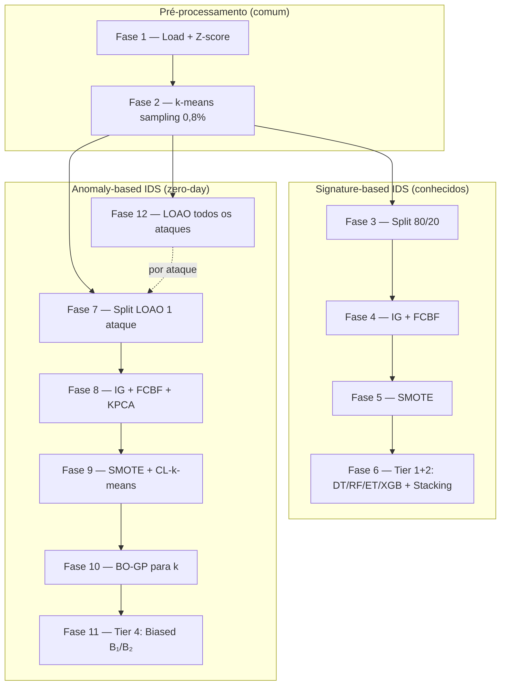

# Pipeline MTH-IDS — Guia das Fases

Documentação das **12 fases** modulares que reproduzem o método **MTH-IDS** (Yang et al., IEEE IoT Journal 2022), com base no notebook [`MTH_IDS_IoTJ.ipynb`](../paper_and_notebooks/MTH_IDS_IoTJ.ipynb).

**Referência:** L. Yang, A. Moubayed, A. Shami, *MTH-IDS: A Multi-Tiered Hybrid Intrusion Detection System for Internet of Vehicles*, IEEE IoT Journal, 2022.

> **Leitura recomendada:** [ARQUITETURA.md](ARQUITETURA.md) · [EXECUCAO.md](EXECUCAO.md) · [README.md](README.md) · [Rodar cada fase manualmente](#rodar-cada-fase-manualmente)

---

## Visão geral

O pipeline divide o método em duas **ramificações** que partem da mesma amostra (fase 2):



| Ramo | Fases | Objetivo no artigo |
|------|-------|-------------------|
| **Supervisionado** | 1–6 | Detectar ataques **conhecidos** (signature-based, tiers 1–2) |
| **Anomaly** | 7–11 | Detectar **um** ataque como zero-day (demo notebook) |
| **LOAO** | 12 | Repetir anomaly para **cada** ataque (Tabela IX) |
| **Global + eval** | 7–11 (merged), 13 | Um detector global + cascata completa (Tabela X) |

**LOAO (fine)** e **global (merged)** são ramos anomaly **diferentes** — ver [EXECUCAO.md](EXECUCAO.md).

---

## Estrutura de diretórios

Por padrão (**protocolo paper**), existem **duas raizes** de artefatos — uma por ramo:

| Pasta | Perfil | Comando |
|-------|--------|---------|
| `data/pipeline_mth_ids_merged/` | merged | `run_supervised` |
| `data/pipeline_mth_ids_fine/` | fine | `run_anomaly` |

Detalhes: [EXECUCAO.md — Bootstrap](EXECUCAO.md#bootstrap-automático).

```
data/pipeline_mth_ids_merged/          # Tabela VII + Tabela X
├── 01_preprocessed.parquet
├── 02_sampled_kmeans.parquet
├── 04_train_after_fcbf.parquet
├── 05_train_after_smote.parquet
├── 06_supervised_metrics.json
├── anomaly/global/                    # fases 7–11 (modo global)
└── phase_reports/
    └── phase13_full_system_eval.json

data/pipeline_mth_ids_fine/          # Tabela IX
├── 01_preprocessed.parquet          # bootstrap auto (fases 1–2 fine)
├── 02_sampled_kmeans.parquet
├── 06_supervised_metrics.json
├── anomaly/
│   └── loao/                        # fase 12
│       ├── attack_1/
│       └── loao_summary.json
└── phase_reports/
```

Relatórios JSON registram parâmetros, shapes, contagens de labels e duração.

---

## Como executar

### Orquestradores

| Comando | Uso |
|---------|-----|
| `python -m mth_ids_pipeline.experiment_runner` | **Entrada principal** — perfil, fases, seeds |
| `python -m mth_ids_pipeline.run_supervised` | Atalho: fases 1–6 |
| `python -m mth_ids_pipeline.run_anomaly` | Atalho: fases 7–11 ou `--loao` |
| `python -m mth_ids_pipeline.run_all` | Alias de `experiment_runner` |
| `python -m mth_ids_pipeline.utils.merge_cicids` | Gera CSV merged ou fine |

Cada fase aceita só `--intermediate-dir`, `--report-dir` e parâmetros da própria fase (sem `--input`/`--output-dir` duplicados). Ramo anomaly usa `--work-dir` (pasta `anomaly/` ou subpasta LOAO).

### Perfis de rótulos (`merged` vs `fine`)

| Perfil | CSV | Artefatos | Classes (supervisionado) | LOAO |
|--------|-----|-----------|--------------------------|------|
| **merged** | `data/CICIDS2017.csv` | `data/pipeline_mth_ids_merged/` | ~7 (famílias, notebook) | ~6 rodadas binárias |
| **fine** | `data/CICIDS2017_fine.csv` | `data/pipeline_mth_ids_fine/` | ~15 (rótulos originais) | ~14 rodadas (Tabela IX) |

O ramo **anomaly** usa sempre **2 rótulos** por experimento (benigno vs ataque); a diferença entre perfis é **quantas rodadas LOAO** existem, não multi-classe com 14 saídas.

**Gerar CSVs** (uma vez, com arquivos em `data/MachineLearningCSV/`):

```powershell
python -m mth_ids_pipeline.utils.merge_cicids --profile merged
python -m mth_ids_pipeline.utils.merge_cicids --profile fine
```

**Fluxo merged (notebook / Tabela VII + LOAO nas 6 famílias):**

```powershell
python -m mth_ids_pipeline.run_supervised --label-profile merged
python -m mth_ids_pipeline.run_anomaly --label-profile merged --from 7 --to 11
python -m mth_ids_pipeline.run_anomaly --label-profile merged --loao
```

**Fluxo fine (Tabela IX ~14 ataques):**

```powershell
python -m mth_ids_pipeline.utils.merge_cicids --profile fine
python -m mth_ids_pipeline.run_anomaly --protocol paper --loao
```

O `run_anomaly` prepara automaticamente: fases **1–2** no fine (`02_…`) e **Tabela VII** no merged (`06_…` copiado para fine). Ver [EXECUCAO.md](EXECUCAO.md#bootstrap-automático).

Artefatos antigos em `data/pipeline_mth_ids_full/` continuam válidos; equivalem ao perfil merged se o CSV já tinha famílias agregadas. Use `--intermediate-dir data/pipeline_mth_ids_full` com `--label-profile merged` se quiser reutilizá-los.

### Exemplos (`experiment_runner`)

```powershell
# Perfil merged explícito
python -m mth_ids_pipeline.experiment_runner --label-profile merged --from 1 --to 6

# Perfil fine: pré-processamento + LOAO
python -m mth_ids_pipeline.experiment_runner --label-profile fine --from 1 --to 2
python -m mth_ids_pipeline.experiment_runner --label-profile fine --run-loao --from 12 --to 12

# LOAO — um ataque
python -m mth_ids_pipeline.experiment_runner --label-profile fine `
  --protocol paper --from 12 --to 12 --attack-label 1
```

### Flags globais importantes

| Flag | Efeito |
|------|--------|
| `--label-profile merged\|fine` | CSV + `intermediate-dir` + minority defaults do perfil |
| `--intermediate-dir PATH` | Raiz de parquets e relatórios (default: merged ou fine conforme o ramo) |
| `--skip-bootstrap` | Anomaly: não preparar `02_` (fine) / `06_` (merged→fine) automaticamente |
| `--minority-labels 6,1,4` | Classes preservadas intactas na fase 2 (merged) |
| `--minority-labels` (fine) | Default: `1,8,9,12,13,14` (= Bot/Infiltration/WebAttack + Heartbleed) |
| `--auto-minority` (fase 2) | Override manual: todos os ataques preservados (dataset grande; evitar no fine) |
| `--random-state 0` | Seed (split, k-means, modelos) |
| `--loao` | Fases 7–12 (fase 12 = LOAO completo) |
| `--run-loao` | Habilita fase 12 no `experiment_runner` |
| `--attack-label N` | LOAO: um zero-day (vira `--attack-labels N` na fase 12) |
| `--attack-labels 1,5` | LOAO: subset de ataques |

---

## Rodar cada fase manualmente

Execute os comandos **na raiz do repositório**. Troque os caminhos se usar outro `--intermediate-dir`.

**Pastas padrão (protocolo paper):**

| Variável | Caminho |
|----------|---------|
| `MERGED` | `data/pipeline_mth_ids_merged` — supervisionado (Tabela VII) |
| `FINE` | `data/pipeline_mth_ids_fine` — anomaly / LOAO (Tabela IX) |
| `LOAO_N` | `data/pipeline_mth_ids_fine/anomaly/loao/attack_<N>` — uma rodada LOAO |

Todas as fases aceitam `--intermediate-dir` e `--report-dir` (default: `<intermediate>/phase_reports`).  
Fases **7–11** do ramo anomaly aceitam também `--work-dir` (pasta onde estão `a01_…`, `a04_…`, etc.).

> **Nota:** não existe módulo `phase03_*` — o split 80/20 supervisionado ocorre **dentro da fase 4**.

### Por intervalo (orquestradores)

Equivalente a rodar várias fases em sequência:

```powershell
# Supervisionado merged (fases 1–6)
python -m mth_ids_pipeline.run_supervised --protocol paper --from 1 --to 6

# Pré-processamento fine (fases 1–2)
python -m mth_ids_pipeline.run_all --label-profile fine --from 1 --to 2

# Um ataque LOAO completo (fases 7→11 dentro da 12)
python -m mth_ids_pipeline.run_all --label-profile fine `
  --protocol paper --from 12 --to 12 --skip-bootstrap `
  --attack-label 1

# Subset de ataques LOAO
python -m mth_ids_pipeline.run_anomaly --protocol paper --loao `
  --attack-labels 1,5,10
```

`run_all`, `run_supervised` e `run_anomaly` são atalhos de `experiment_runner` (repassam `--from`, `--to`, `--protocol`, etc.).

### Fase 1 — load + preprocess

```powershell
# merged
python -m mth_ids_pipeline.phases.phase01_load_preprocess `
  --intermediate-dir data/pipeline_mth_ids_merged `
  --input data/CICIDS2017.csv

# fine
python -m mth_ids_pipeline.phases.phase01_load_preprocess `
  --intermediate-dir data/pipeline_mth_ids_fine `
  --input data/CICIDS2017_fine.csv
```

**Saída:** `01_preprocessed.parquet`

### Fase 2 — k-means sampling (0,8%)

```powershell
python -m mth_ids_pipeline.phases.phase02_sample_kmeans `
  --intermediate-dir data/pipeline_mth_ids_merged `
  --frac 0.008 --n-clusters 1000 --random-state 0

# fine (minoritárias default do perfil fine)
python -m mth_ids_pipeline.phases.phase02_sample_kmeans `
  --intermediate-dir data/pipeline_mth_ids_fine `
  --frac 0.008 --random-state 0
```

**Saída:** `02_sampled_kmeans.parquet`

### Fase 4 — IG + FCBF + split 80/20 (supervisionado)

A fase 4 inclui o split treino/teste (equivalente conceitual à “fase 3”).

```powershell
# Protocolo paper (FCBF no treino, BO-GP α opcional)
python -m mth_ids_pipeline.phases.phase04_feature_engineering `
  --intermediate-dir data/pipeline_mth_ids_merged `
  --fcbf-scope train --scale-mode split `
  --optimize-ig --ig-hpo-calls 15 --cv-folds 10

# Notebook (FCBF no dataset completo)
python -m mth_ids_pipeline.phases.phase04_feature_engineering `
  --intermediate-dir data/pipeline_mth_ids_merged `
  --fcbf-scope full --scale-mode phase1
```

**Saída:** `04_train_after_fcbf.parquet`, `04_test_after_fcbf.parquet`, `04_selected_features.txt`

### Fase 5 — SMOTE (supervisionado)

```powershell
python -m mth_ids_pipeline.phases.phase05_smote `
  --intermediate-dir data/pipeline_mth_ids_merged
```

**Saída:** `05_train_after_smote.parquet`, `05_test_unchanged.parquet`

### Fase 6 — modelos supervisionados (Tabela VII)

```powershell
python -m mth_ids_pipeline.phases.phase06_supervised_models `
  --intermediate-dir data/pipeline_mth_ids_merged `
  --cv-folds 10 --hpo-on-validation --meta-learner best-base

# Rápido (sem HPO)
python -m mth_ids_pipeline.phases.phase06_supervised_models `
  --intermediate-dir data/pipeline_mth_ids_merged --no-hpo --no-plots
```

**Saída:** `06_supervised_metrics.json`

### Fase 7 — partição binária LOAO (um zero-day)

Demo notebook (um ataque em `anomaly/`):

```powershell
python -m mth_ids_pipeline.phases.phase07_anomaly_datasets `
  --intermediate-dir data/pipeline_mth_ids_fine `
  --work-dir data/pipeline_mth_ids_fine/anomaly `
  --attack-label 5
```

Uma rodada LOAO (ataque Bot = label 1):

```powershell
python -m mth_ids_pipeline.phases.phase07_anomaly_datasets `
  --intermediate-dir data/pipeline_mth_ids_fine `
  --work-dir data/pipeline_mth_ids_fine/anomaly/loao/attack_1 `
  --report-dir data/pipeline_mth_ids_fine/anomaly/loao/attack_1/reports `
  --attack-label 1
```

**Saída:** `a01_without_portscan.parquet`, `a02_portscan_only.parquet` (nomes legados do notebook)

### Fase 8 — Z-score + IG + FCBF + KPCA (anomaly)

**Tempo típico LOAO:** ~1 h (KernelPCA ~3 GiB RAM com `feature-fit-scope combined`).

```powershell
python -m mth_ids_pipeline.phases.phase08_anomaly_features `
  --intermediate-dir data/pipeline_mth_ids_fine `
  --work-dir data/pipeline_mth_ids_fine/anomaly/loao/attack_1 `
  --report-dir data/pipeline_mth_ids_fine/anomaly/loao/attack_1/reports `
  --random-state 0 `
  --feature-fit-scope combined --zscore-scope combined `
  --fcbf-k 20 --kpca-components 10 --kpca-kernel rbf `
  --ig-cumulative 0.9 --cv-folds 10 `
  --optimize-ig --optimize-kpca `
  --ig-hpo-calls 15 --kpca-hpo-calls 15
```

**Saída:** `a03_combined_normalized.parquet`, `a04_after_kpca.parquet`, `a06_test_slice.json`

### Fase 9 — SMOTE + CL-k-means inicial

```powershell
python -m mth_ids_pipeline.phases.phase09_anomaly_cluster `
  --intermediate-dir data/pipeline_mth_ids_fine `
  --work-dir data/pipeline_mth_ids_fine/anomaly/loao/attack_1 `
  --report-dir data/pipeline_mth_ids_fine/anomaly/loao/attack_1/reports `
  --random-state 0
```

SMOTE anomaly: classe binária `1` → número de benignos no treino (default notebook).  
**Saída:** `a05_train_after_smote.parquet`

### Fase 10 — BO-GP para `n_clusters` e métrica

```powershell
# Protocolo paper (BO-GP completo; n_calls >= 10)
python -m mth_ids_pipeline.phases.phase10_anomaly_cluster_hpo `
  --intermediate-dir data/pipeline_mth_ids_fine `
  --work-dir data/pipeline_mth_ids_fine/anomaly/loao/attack_1 `
  --report-dir data/pipeline_mth_ids_fine/anomaly/loao/attack_1/reports `
  --random-state 0 --n-calls 15 --hpo-metric f1 `
  --metrics euclidean,manhattan,cosine,mahalanobis

# Preview rápido (sem BO-GP)
python -m mth_ids_pipeline.phases.phase10_anomaly_cluster_hpo `
  --intermediate-dir data/pipeline_mth_ids_fine `
  --work-dir data/pipeline_mth_ids_fine/anomaly/loao/attack_1 `
  --report-dir data/pipeline_mth_ids_fine/anomaly/loao/attack_1/reports `
  --random-state 0 --skip-hpo --hpo-metric f1
```

**Saída:** `reports/phase10_anomaly_cluster_hpo.json` (`best_n_clusters`, `best_metric`)

### Fase 11 — biased B₁/B₂ + p* (Tabela IX por ataque)

Requer `06_supervised_metrics.json` em `--intermediate-dir` (bootstrap copia da Tabela VII merged).

```powershell
python -m mth_ids_pipeline.phases.phase11_anomaly_biased `
  --intermediate-dir data/pipeline_mth_ids_fine `
  --work-dir data/pipeline_mth_ids_fine/anomaly/loao/attack_1 `
  --report-dir data/pipeline_mth_ids_fine/anomaly/loao/attack_1/reports `
  --random-state 0 --biased-mode both --force-biased `
  --optimize-p-star --p-star-n-calls 15
```

**Saída:** `reports/phase11_anomaly_biased.json` → métricas em `mth_ids_anomaly` (DR, FAR, F1)

### Fase 12 — LOAO (todos os ataques ou subset)

Orquestra 7→8→9→10→11 por ataque; grava log em `attack_<N>/loao_run.log`.

```powershell
python -m mth_ids_pipeline.phases.phase12_anomaly_loao `
  --intermediate-dir data/pipeline_mth_ids_fine `
  --report-dir data/pipeline_mth_ids_fine/phase_reports `
  --attack-label 1 `
  --random-state 0 --hpo-n-calls 15 --hpo-metric f1 `
  --biased-mode both --force-biased --optimize-p-star `
  --feature-fit-scope combined --zscore-scope combined `
  --fcbf-k 20 --kpca-components 10 --kpca-kernel rbf `
  --ig-cumulative 0.9 --cv-folds 10 `
  --optimize-ig --optimize-kpca `
  --ig-hpo-calls 15 --kpca-hpo-calls 15 `
  --metrics euclidean,manhattan,cosine,mahalanobis
```

| Flag fase 12 | Efeito |
|--------------|--------|
| `--attack-label N` | Um zero-day |
| `--attack-labels 1,5,10` | Subset |
| `--skip-phase9` | Pula SMOTE inicial (se `a05_…` já existe) |
| `--skip-phase10` | Pula BO-GP de clusters |

Não há `--skip-phase7` nem `--skip-phase8`: reexecutar a fase 12 **sempre refaz** IG/KPCA (~1 h por ataque).

### Retomar um ataque LOAO (fases 9–11 manuais)

Se a fase 8 já terminou e só faltam 9–11 (evita repetir KPCA):

1. Rode as fases **9, 10 e 11** com os comandos acima (`--work-dir` = `attack_<N>`).
2. Atualize o resumo agregado:

```powershell
python -c "
from pathlib import Path
from mth_ids_pipeline.config import CICIDS2017_FINE_LABEL_NAMES
from mth_ids_pipeline.io.loao_reporting import build_loao_summary, write_loao_summary
root = Path('data/pipeline_mth_ids_fine/anomaly/loao')
labels = {k: v for k, v in CICIDS2017_FINE_LABEL_NAMES.items() if k > 0}
summary = build_loao_summary(root, labels, attacks_in_dataset=len(labels))
write_loao_summary(root, summary)
print('Atualizado:', root / 'loao_summary.json')
"

python -m mth_ids_pipeline.report_paper_tables --table ix `
  --loao-root data/pipeline_mth_ids_fine/anomaly/loao
```

Execução manual **não** acrescenta saída ao `loao_run.log` (só a fase 12 grava esse arquivo).

### Ver resultados

| O quê | Onde |
|-------|------|
| Métricas por ataque LOAO | `anomaly/loao/attack_<N>/reports/phase11_anomaly_biased.json` |
| Resumo Tabela IX | `anomaly/loao/loao_summary.json` |
| Tabela VII | `06_supervised_metrics.json` |
| Relatório no terminal + `results/` | `python -m mth_ids_pipeline.report_paper_tables --table all` |

---

## Fases em detalhe

### Fase 1 — `phase01_load_preprocess`

**Papel:** Entrada bruta → dataset numérico normalizado.

**O que faz:**
- Lê o CSV CICIDS2017 (`data/CICIDS2017.csv` por padrão).
- Aplica **Z-score** em colunas numéricas: `(x - mean) / std`.
- Preenche **NaN com 0**.
- Mantém a coluna `Label` como string (BENIGN, DoS, PortScan, …).

**Entrada:** CSV bruto (`--input`).

**Saída:** `01_preprocessed.parquet` (~2,8M linhas no dataset completo).

**Módulo core:** `preprocessing.py`, `data_loading.py`.

**Tempo típico:** alguns minutos no CSV completo (I/O + normalização).

---

### Fase 2 — `phase02_sample_kmeans`

**Papel:** Reduzir o dataset para ~0,8% mantendo classes raras.

**O que faz:**
- Aplica **LabelEncoder** (rótulos viram inteiros 0, 1, 2, …).
- Separa classes **minoritárias** (`--minority-labels`, default `6,1,4`) — entram **inteiras**.
- Na classe majoritária (BENIGN): **MiniBatchKMeans** com k=1000 clusters.
- Amostra **0,8%** (`--frac 0.008`) de cada cluster.
- Concatena majoritária amostrada + minoritárias.

**Entrada:** `01_preprocessed.parquet`.

**Saída:** `02_sampled_kmeans.parquet` (~27k linhas).

**Parâmetros chave:** `--n-clusters 1000`, `--frac 0.008`, `--minority-labels`.

**Nota:** Após rodar a fase 1 no CSV completo, confira o mapeamento label→inteiro em `phase_reports/phase02_sample_kmeans.json` antes de fixar `--minority-labels`.

#### Perfil `merged` vs `fine` (minoritárias na fase 2)

| Perfil | Default `--minority-labels` | Critério |
|--------|----------------------------|----------|
| **merged** | `6,1,4` (WebAttack, Bot, Infiltration) | Igual ao `df_minor` do notebook |
| **fine** | `1,8,9,12,13,14` | Fine cujo destino merged ∈ `{Bot, Infiltration, WebAttack}` + Heartbleed (ultra-raro) |
| **can_merged / can_fine** | — (`--sample-all-classes`) | k-means 0,8% em **todas** as classes; ver [PROTOCOLO_CAN.md](PROTOCOLO_CAN.md) |

No **fine**, a regra **não** é “preservar rótulos que o merge não agrega”. **PortScan** não é agregado, mas é amostrado (k-means 0,8%) porque no merged também não entra no `df_minor`. Os subtipos **Web Attack** são agregados em WebAttack no merge, mas ficam **inteiros** no fine porque a família WebAttack está no `df_minor`.

Detalhes e tabela completa: [EXECUCAO.md](EXECUCAO.md#bootstrap-automático).

---

### Fase 3 — split 80/20 (dentro da fase 4)

**Papel:** Primeiro split estratificado do ramo **supervisionado**.

Não há módulo `phase03_*`. O split ocorre em `phase04_feature_engineering.py` via `train_test_split` antes de IG/FCBF.

**O que faz:**
- `train_test_split` estratificado com `random_state=0`.
- Default (`--protocol paper` e `notebook`): **80% treino / 20% teste** (`--test-size 0.2`, alinhado ao notebook).
- Legado artigo (texto): 70/30 (`PAPER_TEST_SIZE=0.3` em `config.py`; não usado pelo runner).

**Entrada:** `02_sampled_kmeans.parquet`.

**Saída:** parquets da fase 4 (`04_train_after_fcbf.parquet`, `04_test_after_fcbf.parquet`) — não existem `03_train.parquet` / `03_test.parquet` separados.

---

### Fase 4 — `phase04_feature_engineering`

**Papel:** Seleção de atributos (Information Gain + FCBF).

**O que faz:**
1. Split interno 80/20 sobre a amostra completa (para IG).
2. **Information Gain** (mutual information): mantém features até **90%** da MI acumulada.
3. **FCBF** (Fast Correlation-Based Filter): top **k=20** features (`--fcbf-k`).
4. Segundo split 80/20 sobre o subconjunto reduzido.

**Entrada:** `02_sampled_kmeans.parquet` (ou `--input`).

**Saída:**
- `04_train_after_fcbf.parquet`
- `04_test_after_fcbf.parquet`
- `04_selected_features.txt`

**Dependência:** `FCBF_module.py` na raiz do repositório.

**Tier artigo:** feature engineering pré-supervisionado.

---

### Fase 5 — `phase05_smote`

**Papel:** Balanceamento do treino supervisionado.

**O que faz:**
- **SMOTE** apenas no conjunto de **treino** (teste inalterado).
- Padrão (`--protocol paper` e `notebook`): **BruteForce (2) e Infiltration (4) → 1 000** cada (`NOTEBOOK_SMOTE_TARGETS`; igual ao notebook IoTJ).
- Texto do artigo (`PAPER_SMOTE_TARGETS`): quatro famílias → 100 000 — não usado pelo runner.

**Entrada:** parquets da fase 4.

**Saída:** `05_train_after_smote.parquet`, `05_test_unchanged.parquet`.

**CAN (`--protocol can`):** fase **omitida**; o orquestrador copia `04_*` → `05_*` após a fase 4. Ver [PROTOCOLO_CAN.md](PROTOCOLO_CAN.md).

---

### Fase 6 — `phase06_supervised_models`

**Papel:** IDS **signature-based** — tiers 1 e 2 do artigo.

**O que faz:**
- Treina quatro classificadores base:
  - **Decision Tree** (DT)
  - **Random Forest** (RF)
  - **Extra Trees** (ET)
  - **XGBoost** (XGB)
- **HPO opcional** com **BO-TPE** (Hyperopt, `--no-hpo` usa params fixos do notebook).
- **Stacking:** meta-learner sobre predições dos quatro bases.
  - `--meta-learner best-base` (**`--protocol paper`**): `clone` do melhor base (maior F1 weighted no hold-out).
  - `--meta-learner xgb` (**`--protocol notebook`**): meta XGBoost + HPO opcional.
- Métricas: accuracy, precision, recall, F1 (weighted) no **hold-out teste**; opcional `--binary`.
- Com `--cv-folds N`: relatório **N-fold CV estratificado no treino** (todos os modelos) — comparável à Tabela VII.
- **HPO** (sem `--no-hpo`):
  - default (notebook): maximiza acurácia no **conjunto de teste**;
  - `--hpo-on-validation`: maximiza acurácia média de **CV no treino** (10 folds se `--cv-folds` omitido).

**Entrada:** parquets SMOTE da fase 5.

**Saída:** `06_supervised_metrics.json`, relatório `phase06_supervised_models.json` (inclui `cv_reports` se CV ativo).

**Flags úteis:**
- Padrão (`--protocol paper`): 80/20, SMOTE notebook `{2,4}→1000`, CV 10-fold, meta **best-base**, **BO-TPE (HPO) na validação**.
- Padrão (`--protocol notebook`): 80/20, SMOTE notebook, HPO no hold-out, meta **xgb**.
- `--no-hpo --no-plots` — treino rápido com hiperparâmetros fixos (não reproduz o artigo).

**Resultado típico (amostra):** stacking ~99,5% accuracy.

---

### Fase 7 — `phase07_anomaly_datasets`

**Papel:** Montar datasets para detecção **zero-day** (um ataque por vez).

**O que faz:**
- A partir da amostra (fase 2), separa:
  - **df1:** todos os fluxos **exceto** o ataque zero-day → binário (0=normal/outros, 1=ataque).
  - **df2:** **somente** o ataque escolhido → binário (1=ataque zero-day).
- Default: ataque **PortScan** (`--attack-label 5` no encoding do notebook).

**Entrada:** `02_sampled_kmeans.parquet`.

**Saída** (em `anomaly/`):
- `a01_without_portscan.parquet` (nome legado; conteúdo = sem o ataque alvo)
- `a02_portscan_only.parquet` (nome legado; conteúdo = só o ataque alvo)

**Nota:** Os nomes dos arquivos referem-se ao notebook; use `--attack-label N` para outro ataque.

---

### Fase 8 — `phase08_anomaly_features`

**Papel:** Pré-processamento e redução de dimensionalidade do ramo anomaly.

**O que faz:**
1. Re-normalização **Z-score** em df1 e df2.
2. Amostra **benignos** de df1 e mistura em df2: por padrão `min(len(zero-day), benignos_disponíveis)` (Tabela IX); `--benign-target` só como override.
3. **IG 90% + FCBF k=20** sobre o conjunto combinado.
4. **Kernel PCA** (n=10, kernel RBF) — só no ramo anomaly.

**Entrada:** parquets da fase 7.

**Saída:**
- `a03_combined_normalized.parquet`
- `a04_after_kpca.parquet`
- `a06_test_slice.json` (índice que separa treino df1 vs teste df2+benignos)

**Tempo típico:** demo notebook ~5–10 min; **LOAO com BO-GP IG+KPCA** ~1 h por ataque (KernelPCA ~3 GiB RAM no combinado).

---

### Fase 9 — `phase09_anomaly_cluster`

**Papel:** Tier 3 — **CL-k-means** (cluster labeling).

**O que faz:**
1. Divide `a04_after_kpca.parquet` em treino (parte df1) e teste (df2 + benignos amostrados).
2. **SMOTE** na classe ataque do treino → alvo = nº de **benignos** no treino (default notebook; ex. 18225 no demo PortScan). Compatível com `imbalanced-learn` recente (sem `n_jobs` fixo).
3. **CL-k-means:** MiniBatchKMeans + rotula clusters como benigno/ataque pela classe majoritária no cluster.
4. Calcula **confiança pᵢ** (proporção da classe majoritária no cluster).

**Entrada:** saídas da fase 8.

**Saída:** `a05_train_after_smote.parquet`, métricas no relatório JSON.

**Parâmetro:** `--n-clusters` (default 8; fase 10 otimiza).

---

### Fase 10 — `phase10_anomaly_cluster_hpo`

**Papel:** Otimizar **k** (número de clusters) com **BO-GP** (scikit-optimize).

**O que faz:**
- Baseline CL-k-means com k=8.
- **gp_minimize** em k ∈ [2, 50], 20 avaliações (`--n-calls 20`).
- Opcional: `--optimize-metric` também busca métrica euclidiana vs manhattan.
- Registra `best_n_clusters` usado pela fase 11.

**Entrada:** diretório `anomaly/` (splits via `anomaly_io.load_anomaly_splits`).

**Saída:** `phase_reports/phase10_anomaly_cluster_hpo.json`.

**Resultado típico:** k=10 na amostra PortScan.

---

### Fase 11 — `phase11_anomaly_biased`

**Papel:** Tier 4 — **biased classifiers** B₁ e B₂ + limiar **p* = 0,933**.

**O que faz:**
1. CL-k-means com k da fase 10 (ou `--n-clusters`).
2. Fluxos com confiança **pᵢ < p*** são “incertos” → refinados por classificadores enviesados:
   - **B₁:** treinado para reduzir **falsos positivos** (FP).
   - **B₂:** treinado para reduzir **falsos negativos** (FN).
3. Família do classificador = melhor modelo da **fase 6** (XGB, RF, etc.).
4. Modo **`--biased-mode auto`** (default no experiment_runner): testa none / b1-only / b2-only / both no hold-out interno e aplica só o que **melhora F1 no teste interno** (geralmente **b1-only**).
5. Métricas binárias: **DR**, **FAR**, **F1**.

**Entrada:** diretório `anomaly/`; `06_supervised_metrics.json` no `--intermediate-dir` (cópia da **Tabela VII merged** — ver [EXECUCAO.md](EXECUCAO.md#bootstrap-automático)).

**Saída:** `phase_reports/phase11_anomaly_biased.json`.

**Resultado típico (PortScan, B₁ auto):** F1 ~0,87, DR ~86%.

**Atenção:** `--biased-mode both --no-gate` reproduz o artigo literalmente mas pode **destruir recall** no teste real (F1 ~0,04).

---

### Fase 12 — `phase12_anomaly_loao`

**Papel:** **Leave-One-Attack-Out** — avaliação completa do anomaly (Tabela IX).

**O que faz:**
- Para **cada** label de ataque na amostra (exceto BENIGN=0):
  1. Executa fases **7 → 8 → 9 → 10 → 11** em subdiretório `anomaly/loao/attack_N/`.
  2. Coleta F1, DR, FAR por ataque.
- Agrega médias e compara com referência do artigo (`mean_f1: 0.80013`, …).

**Entrada:** `02_sampled_kmeans.parquet`.

**Saída:** `anomaly/loao/loao_summary.json`, relatório `phase12_anomaly_loao.json`.

**Flags:** `--attack-labels 1,3,5` (subset), `--phase11-extra "--biased-mode auto"`.

**Tempo:** longo (N ataques × fase 8 KPCA + treino).

**Nota:** A fase 12 chama a fase 10 (BO-GP) por ataque; a fase 11 usa `best_n_clusters` do relatório da fase 10.

---

### Anomaly global (fases 7–11) — Tabela X

**Papel:** Treinar **um** detector anomaly binário (benigno vs ataque) no perfil **merged**, distinto do LOAO fine.

**Orquestrador:** `run_global_anomaly` → fases 7–11 com `--mode global` em `anomaly/global/`.

**Pré-requisitos:** fases **1–2** e **4–6** concluídas em `pipeline_mth_ids_merged`.

```powershell
python -m mth_ids_pipeline.run_global_anomaly --protocol paper
```

**Diferença da fase 7 LOAO:** não exclui um ataque; treina no 80% do split supervisionado; o hold-out 20% fica para a fase 13.

---

### Fase 13 — `phase13_full_system_eval`

**Papel:** Avaliação **end-to-end** da cascata MTH-IDS no hold-out (Tabela X, figuras 4–5).

**O que faz:**
1. Tier 1–2: Z-score + stacking (modelos da fase 6).
2. Fluxos classificados como ataque conhecido → predição multi-class.
3. Fluxos “Normal” → tier 3–4 (KPCA + CL-k-means + B₁/B₂ da pasta `anomaly/global`).
4. Métricas Acc, DR, FAR, F1 + confusion matrices.

**Entrada:** `--intermediate-dir` merged + `--work-dir …/anomaly/global`.

```powershell
python -m mth_ids_pipeline.run_eval `
  --intermediate-dir data/pipeline_mth_ids_merged `
  --work-dir data/pipeline_mth_ids_merged/anomaly/global
python -m mth_ids_pipeline.report_paper_tables --table x `
  --merged-dir data/pipeline_mth_ids_merged
```

**Saída:** `phase_reports/phase13_full_system_eval.json`, `figures/fig_multiclass_cm.png`, `figures/fig_binary_cm.png`. Tabelas formatadas vs artigo: `report_paper_tables` → `results/`.

---

## Mapeamento para o artigo MTH-IDS

| Tier (artigo) | Componente | Fase(s) |
|---------------|------------|---------|
| Pré-processamento | Z-score, sampling | 1–2 |
| Feature selection | IG + FCBF | 4 (supervisionado), 8 (anomaly) |
| Redução | Kernel PCA | 8 |
| Tier 1 | DT, RF, ET, XGB | 6 |
| Tier 2 | Stacking + BO-TPE | 6 |
| Tier 3 | CL-k-means + BO-GP (k) | 9–10 |
| Tier 4 | Biased B₁/B₂ + p* | 11 |
| Avaliação zero-day | LOAO | 7 (1 ataque), 12 (todos) |
| Sistema completo | Cascata tiers 1→4 no hold-out | 13 (+ global 7–11) |

---

## Módulos auxiliares

| Módulo | Função |
|--------|--------|
| `config.py` | Caminhos, `--intermediate-dir`, `parse_minority_labels` |
| `clustering.py` | k-means sampling (fase 2), CL-k-means (fase 9+) |
| `feature_selection.py` | Information Gain |
| `dimensionality_reduction.py` | Kernel PCA |
| `hyperparameter_optimization.py` | BO-TPE, BO-GP |
| `biased_classifiers.py` | B₁/B₂, modo auto, p* |
| `anomaly_io.py` | Splits LOAO, SMOTE anomaly, descoberta de labels |
| `loao_reporting.py` | `loao_summary.json`, agregação Tabela IX |
| `run_log.py` | Logs de execução (`RunLog`) → `results/logs/`; LOAO também espelha em `results/logs/loao/` |
| `evaluation.py` | DR, FAR, F1, comparação com artigo |
| `experiment_runner.py` | Orquestração reprodutível, bootstrap |
| `report_paper_tables.py` | Tabela VII / IX / X → terminal + `results/` |
| `run_global_anomaly.py` | Orquestra fases 7–11 modo global (merged) |
| `run_eval.py` | Atalho fase 13 |
| `core/inference.py` | Cascata tiers 1→4 (fase 13) |
| `io/model_io.py` | Persistência de modelos supervisionado/anomaly |

---

## Solução de problemas

| Erro / sintoma | Causa provável | O que fazer |
|----------------|----------------|-------------|
| `02_sampled_kmeans.parquet` não encontrado (Tabela X) | Merged sem fases 1–2 | `run_supervised --from 1 --to 2` no merged |
| `02_sampled_kmeans.parquet` não encontrado (LOAO) | Fine sem bootstrap | `run_anomaly` sem `--skip-bootstrap`, ou fases 1–2 no fine |
| `06_supervised_metrics.json` ausente (fase 11) | Tabela VII não rodou no merged | `run_supervised --protocol paper` (bootstrap copia para fine) |
| `SMOTE … n_jobs` na fase 9 | `imbalanced-learn` antigo no código | Atualizar repo; `anomaly_io` já trata API |
| `n_calls >= 10` (skopt) | `--n-calls` ou `--p-star-n-calls` < 10 | Usar ≥ 15 (padrão paper) |
| LOAO refaz fase 8 (~1 h) | Fase 12 sem skip 7/8 | Retomar fases 9–11 manualmente se `a04_…` existe |
| `loao_summary.json` com 0 ataques | Falha mid-run; resumo não reconstruído | Script em [Retomar LOAO](#retomar-um-ataque-loao-fases-911-manuais) |
| Tabela IX vazia no terminal | Mesmo que acima | Reconstruir `loao_summary` antes de `report_paper_tables` |
| `MemoryError` na fase 8 | KernelPCA grande | Fechar apps; menos RAM → máquina com mais memória |

Mais contexto: [EXECUCAO.md — Solução de problemas](EXECUCAO.md#solução-de-problemas), [README.md](README.md).

---

## Documentos relacionados

- [README.md](README.md) — índice da documentação
- [PAPER_PROTOCOL.md](PAPER_PROTOCOL.md) — protocolo paper vs notebook
- [ARQUITETURA.md](ARQUITETURA.md) — tiers, experimentos, layout do pacote
- [EXECUCAO.md](EXECUCAO.md) — comandos, pastas, bootstrap
- [PAPER_PROTOCOL.md](PAPER_PROTOCOL.md) — parâmetros paper / notebook / CAN
- [archive/METHODOLOGICAL_AUDIT.md](archive/METHODOLOGICAL_AUDIT.md) — divergências artigo × notebook × código
- [archive/REPRODUCTION_REPORT.md](archive/REPRODUCTION_REPORT.md) — resultados e validação numérica
