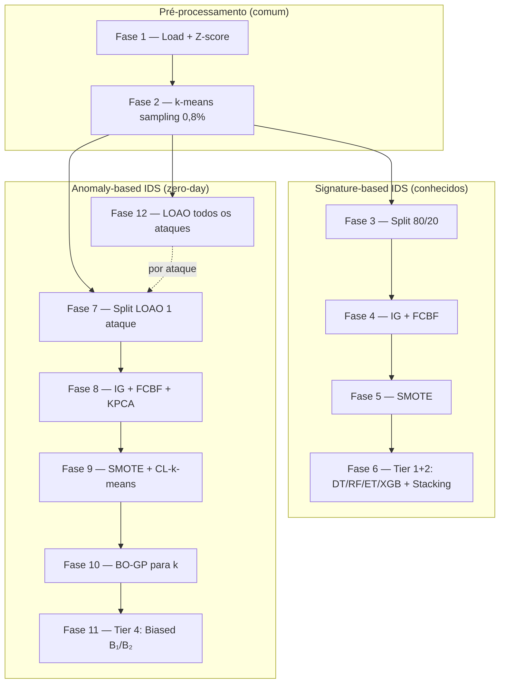

# Pipeline MTH-IDS — Guia das Fases

Documentação das **12 fases** modulares que reproduzem o método **MTH-IDS** (Yang et al., IEEE IoT Journal 2022), com base no notebook [`MTH_IDS_IoTJ.ipynb`](../paper_and_notebooks/MTH_IDS_IoTJ.ipynb).

**Referência:** L. Yang, A. Moubayed, A. Shami, *MTH-IDS: A Multi-Tiered Hybrid Intrusion Detection System for Internet of Vehicles*, IEEE IoT Journal, 2022.

> **Leitura recomendada:** [GUIA_ARQUITETURA_MTH_IDS.md](GUIA_ARQUITETURA_MTH_IDS.md) — explica os dois ramos (supervisionado vs anomaly), a diferença entre 7 classes e 14 LOAO, e os perfis `merged` / `fine`.

---

## Visão geral

O pipeline divide o método em duas **ramificações** que partem da mesma amostra (fase 2):



| Ramo | Fases | Objetivo no artigo |
|------|-------|-------------------|
| **Supervisionado** | 1–6 | Detectar ataques **conhecidos** (signature-based, tiers 1–2) |
| **Anomaly** | 7–11 | Detectar **um** ataque como zero-day (demo notebook) |
| **LOAO** | 12 | Repetir anomaly para **cada** ataque (Tabela IX) |

---

## Estrutura de diretórios

Por padrão, artefatos ficam em `data/pipeline_mth_ids/`. Use `--intermediate-dir` para outro caminho (ex.: `data/pipeline_mth_ids_full`).

```
data/pipeline_mth_ids/
├── 01_preprocessed.parquet          # Fase 1
├── 02_sampled_kmeans.parquet        # Fase 2
├── 03_train.parquet                 # Fase 3
├── 03_test.parquet
├── 04_train_after_fcbf.parquet      # Fase 4
├── 04_test_after_fcbf.parquet
├── 04_selected_features.txt
├── 05_train_after_smote.parquet     # Fase 5
├── 05_test_unchanged.parquet
├── 06_supervised_metrics.json       # Fase 6
├── anomaly/                         # Ramo anomaly (fases 7–11)
│   ├── a01_without_portscan.parquet
│   ├── a02_portscan_only.parquet
│   ├── a03_combined_normalized.parquet
│   ├── a04_after_kpca.parquet
│   ├── a05_train_after_smote.parquet
│   ├── a06_test_slice.json
│   └── loao/                        # Fase 12
│       ├── attack_1/
│       ├── attack_3/
│       └── loao_summary.json
└── phase_reports/                   # JSON por fase
    ├── phase01_load_preprocess.json
    └── ...
```

Relatórios JSON registram parâmetros, shapes, contagens de labels e duração.

---

## Como executar

### Orquestradores

| Comando | Uso |
|---------|-----|
| `python -m mth_ids_pipeline.experiment_runner` | **Entrada principal** — perfil, fases, seeds |
| `python -m mth_ids_pipeline.run_supervised` | Atalho: fases 1–6 |
| `python -m mth_ids_pipeline.run_anomaly` | Atalho: fases 7–11 ou `--loao` |
| `python -m mth_ids_pipeline.run_all` | Alias de `experiment_runner` |
| `python -m mth_ids_pipeline.utils.merge_cicids` | Gera CSV merged ou fine |

Cada fase aceita só `--intermediate-dir`, `--report-dir` e parâmetros da própria fase (sem `--input`/`--output-dir` duplicados). Ramo anomaly usa `--work-dir` (pasta `anomaly/` ou subpasta LOAO).

### Perfis de rótulos (`merged` vs `fine`)

| Perfil | CSV | Artefatos | Classes (supervisionado) | LOAO |
|--------|-----|-----------|--------------------------|------|
| **merged** | `data/CICIDS2017.csv` | `data/pipeline_mth_ids_merged/` | ~7 (famílias, notebook) | ~6 rodadas binárias |
| **fine** | `data/CICIDS2017_fine.csv` | `data/pipeline_mth_ids_fine/` | ~15 (rótulos originais) | ~14 rodadas (Tabela IX) |

O ramo **anomaly** usa sempre **2 rótulos** por experimento (benigno vs ataque); a diferença entre perfis é **quantas rodadas LOAO** existem, não multi-classe com 14 saídas.

**Gerar CSVs** (uma vez, com arquivos em `data/MachineLearningCSV/`):

```powershell
python -m mth_ids_pipeline.utils.merge_cicids --profile merged
python -m mth_ids_pipeline.utils.merge_cicids --profile fine
```

**Fluxo merged (notebook / Tabela VII + LOAO nas 6 famílias):**

```powershell
python -m mth_ids_pipeline.run_supervised --label-profile merged
python -m mth_ids_pipeline.run_anomaly --label-profile merged --from 7 --to 11
python -m mth_ids_pipeline.run_anomaly --label-profile merged --loao
```

**Fluxo fine (Tabela IX ~14 ataques):**

```powershell
python -m mth_ids_pipeline.run_supervised --label-profile fine --from 1 --to 2
python -m mth_ids_pipeline.run_anomaly --label-profile fine --loao
```

Artefatos antigos em `data/pipeline_mth_ids_full/` continuam válidos; equivalem ao perfil merged se o CSV já tinha famílias agregadas. Use `--intermediate-dir data/pipeline_mth_ids_full` com `--label-profile merged` se quiser reutilizá-los.

### Exemplos (`experiment_runner`)

```powershell
# Perfil merged explícito
python -m mth_ids_pipeline.experiment_runner --label-profile merged --from 1 --to 6

# Perfil fine: pré-processamento + LOAO
python -m mth_ids_pipeline.experiment_runner --label-profile fine --from 1 --to 2
python -m mth_ids_pipeline.experiment_runner --label-profile fine --run-loao --from 12 --to 12

# Padrão = artigo (supervisionado)
python -m mth_ids_pipeline.experiment_runner --label-profile merged --from 1 --to 6

python -m mth_ids_pipeline.experiment_runner --label-profile merged --from 1 --to 6
```

### Flags globais importantes

| Flag | Efeito |
|------|--------|
| `--label-profile merged\|fine` | CSV + `intermediate-dir` + minority defaults do perfil |
| `--intermediate-dir PATH` | Raiz de todos os parquets e relatórios |
| `--minority-labels 6,1,4` | Classes preservadas intactas na fase 2 (merged) |
| `--auto-minority` (fase 2) | Todos os ataques preservados (fine; automático com perfil fine) |
| `--random-state 0` | Seed (split, k-means, modelos) |
| *(padrão)* | **Artigo:** split 70/30, SMOTE 100k, CV 10-fold, meta best-base, HPO na validação |
| `--run-loao` | Habilita fase 12 no experiment_runner |

---

## Fases em detalhe

### Fase 1 — `phase01_load_preprocess`

**Papel:** Entrada bruta → dataset numérico normalizado.

**O que faz:**
- Lê o CSV CICIDS2017 (`data/CICIDS2017.csv` por padrão).
- Aplica **Z-score** em colunas numéricas: `(x - mean) / std`.
- Preenche **NaN com 0**.
- Mantém a coluna `Label` como string (BENIGN, DoS, PortScan, …).

**Entrada:** CSV bruto (`--input`).

**Saída:** `01_preprocessed.parquet` (~2,8M linhas no dataset completo).

**Módulo core:** `preprocessing.py`, `data_loading.py`.

**Tempo típico:** alguns minutos no CSV completo (I/O + normalização).

---

### Fase 2 — `phase02_sample_kmeans`

**Papel:** Reduzir o dataset para ~0,8% mantendo classes raras.

**O que faz:**
- Aplica **LabelEncoder** (rótulos viram inteiros 0, 1, 2, …).
- Separa classes **minoritárias** (`--minority-labels`, default `6,1,4`) — entram **inteiras**.
- Na classe majoritária (BENIGN): **MiniBatchKMeans** com k=1000 clusters.
- Amostra **0,8%** (`--frac 0.008`) de cada cluster.
- Concatena majoritária amostrada + minoritárias.

**Entrada:** `01_preprocessed.parquet`.

**Saída:** `02_sampled_kmeans.parquet` (~27k linhas).

**Parâmetros chave:** `--n-clusters 1000`, `--frac 0.008`, `--minority-labels`.

**Nota:** Após rodar a fase 1 no CSV completo, confira o mapeamento label→inteiro em `phase_reports/phase02_sample_kmeans.json` antes de fixar `--minority-labels`.

---

### Fase 3 — `phase03_train_test_split`

**Papel:** Primeiro split estratificado do ramo **supervisionado**.

**O que faz:**
- `train_test_split` estratificado com `random_state=0`.
- Default: **80% treino / 20% teste** (`--test-size 0.2`).
- Padrão (artigo): **70% / 30%** (`DEFAULT_TEST_SIZE=0.3`).

**Entrada:** `02_sampled_kmeans.parquet`.

**Saída:** `03_train.parquet`, `03_test.parquet`.

---

### Fase 4 — `phase04_feature_engineering`

**Papel:** Seleção de atributos (Information Gain + FCBF).

**O que faz:**
1. Split interno 80/20 sobre a amostra completa (para IG).
2. **Information Gain** (mutual information): mantém features até **90%** da MI acumulada.
3. **FCBF** (Fast Correlation-Based Filter): top **k=20** features (`--fcbf-k`).
4. Segundo split 80/20 sobre o subconjunto reduzido.

**Entrada:** `02_sampled_kmeans.parquet` (ou `--input`).

**Saída:**
- `04_train_after_fcbf.parquet`
- `04_test_after_fcbf.parquet`
- `04_selected_features.txt`

**Dependência:** `FCBF_module.py` na raiz do repositório.

**Tier artigo:** feature engineering pré-supervisionado.

---

### Fase 5 — `phase05_smote`

**Papel:** Balanceamento do treino supervisionado.

**O que faz:**
- **SMOTE** apenas no conjunto de **treino** (teste inalterado).
- Padrão (artigo): famílias **Bot (1), BruteForce (2), Infiltration (4), WebAttack (6)** → **100.000** cada (`PAPER_SMOTE_TARGETS` em `config.py`).

**Entrada:** parquets da fase 4.

**Saída:** `05_train_after_smote.parquet`, `05_test_unchanged.parquet`.

---

### Fase 6 — `phase06_supervised_models`

**Papel:** IDS **signature-based** — tiers 1 e 2 do artigo.

**O que faz:**
- Treina quatro classificadores base:
  - **Decision Tree** (DT)
  - **Random Forest** (RF)
  - **Extra Trees** (ET)
  - **XGBoost** (XGB)
- **HPO opcional** com **BO-TPE** (Hyperopt, `--no-hpo` usa params fixos do notebook).
- **Stacking:** meta-learner sobre predições dos quatro bases.
  - `--meta-learner best-base` (**artigo**): `clone` do melhor base (maior F1 weighted no hold-out).
  - `--meta-learner xgb` (**notebook**, default): meta XGBoost + HPO opcional.
- Métricas: accuracy, precision, recall, F1 (weighted) no **hold-out teste**; opcional `--binary`.
- Com `--cv-folds N`: relatório **N-fold CV estratificado no treino** (todos os modelos) — comparável à Tabela VII.
- **HPO** (sem `--no-hpo`):
  - default (notebook): maximiza acurácia no **conjunto de teste**;
  - `--hpo-on-validation`: maximiza acurácia média de **CV no treino** (10 folds se `--cv-folds` omitido).

**Entrada:** parquets SMOTE da fase 5.

**Saída:** `06_supervised_metrics.json`, relatório `phase06_supervised_models.json` (inclui `cv_reports` se CV ativo).

**Flags úteis:**
- Padrão (artigo): 70/30, SMOTE 100k, CV 10-fold, meta best-base, **BO-TPE (HPO) na validação**.
- `--no-hpo --no-plots` — treino rápido com hiperparâmetros fixos (não reproduz o artigo).

**Resultado típico (amostra):** stacking ~99,5% accuracy.

---

### Fase 7 — `phase07_anomaly_datasets`

**Papel:** Montar datasets para detecção **zero-day** (um ataque por vez).

**O que faz:**
- A partir da amostra (fase 2), separa:
  - **df1:** todos os fluxos **exceto** o ataque zero-day → binário (0=normal/outros, 1=ataque).
  - **df2:** **somente** o ataque escolhido → binário (1=ataque zero-day).
- Default: ataque **PortScan** (`--attack-label 5` no encoding do notebook).

**Entrada:** `02_sampled_kmeans.parquet`.

**Saída** (em `anomaly/`):
- `a01_without_portscan.parquet` (nome legado; conteúdo = sem o ataque alvo)
- `a02_portscan_only.parquet` (nome legado; conteúdo = só o ataque alvo)

**Nota:** Os nomes dos arquivos referem-se ao notebook; use `--attack-label N` para outro ataque.

---

### Fase 8 — `phase08_anomaly_features`

**Papel:** Pré-processamento e redução de dimensionalidade do ramo anomaly.

**O que faz:**
1. Re-normalização **Z-score** em df1 e df2.
2. Amostra **benignos** de df1 e mistura em df2: por padrão `min(len(zero-day), benignos_disponíveis)` (Tabela IX); `--benign-target` só como override.
3. **IG 90% + FCBF k=20** sobre o conjunto combinado.
4. **Kernel PCA** (n=10, kernel RBF) — só no ramo anomaly.

**Entrada:** parquets da fase 7.

**Saída:**
- `a03_combined_normalized.parquet`
- `a04_after_kpca.parquet`
- `a06_test_slice.json` (índice que separa treino df1 vs teste df2+benignos)

**Tempo típico:** ~5–10 min na amostra (~27k linhas).

---

### Fase 9 — `phase09_anomaly_cluster`

**Papel:** Tier 3 — **CL-k-means** (cluster labeling).

**O que faz:**
1. Divide `a04_after_kpca.parquet` em treino (parte df1) e teste (df2 + benignos amostrados).
2. **SMOTE** na classe ataque do treino → **18225** amostras (`--smote-target`).
3. **CL-k-means:** MiniBatchKMeans + rotula clusters como benigno/ataque pela classe majoritária no cluster.
4. Calcula **confiança pᵢ** (proporção da classe majoritária no cluster).

**Entrada:** saídas da fase 8.

**Saída:** `a05_train_after_smote.parquet`, métricas no relatório JSON.

**Parâmetro:** `--n-clusters` (default 8; fase 10 otimiza).

---

### Fase 10 — `phase10_anomaly_cluster_hpo`

**Papel:** Otimizar **k** (número de clusters) com **BO-GP** (scikit-optimize).

**O que faz:**
- Baseline CL-k-means com k=8.
- **gp_minimize** em k ∈ [2, 50], 20 avaliações (`--n-calls 20`).
- Opcional: `--optimize-metric` também busca métrica euclidiana vs manhattan.
- Registra `best_n_clusters` usado pela fase 11.

**Entrada:** diretório `anomaly/` (splits via `anomaly_io.load_anomaly_splits`).

**Saída:** `phase_reports/phase10_anomaly_cluster_hpo.json`.

**Resultado típico:** k=10 na amostra PortScan.

---

### Fase 11 — `phase11_anomaly_biased`

**Papel:** Tier 4 — **biased classifiers** B₁ e B₂ + limiar **p* = 0,933**.

**O que faz:**
1. CL-k-means com k da fase 10 (ou `--n-clusters`).
2. Fluxos com confiança **pᵢ < p*** são “incertos” → refinados por classificadores enviesados:
   - **B₁:** treinado para reduzir **falsos positivos** (FP).
   - **B₂:** treinado para reduzir **falsos negativos** (FN).
3. Família do classificador = melhor modelo da **fase 6** (XGB, RF, etc.).
4. Modo **`--biased-mode auto`** (default no experiment_runner): testa none / b1-only / b2-only / both no hold-out interno e aplica só o que **melhora F1 no teste interno** (geralmente **b1-only**).
5. Métricas binárias: **DR**, **FAR**, **F1**.

**Entrada:** diretório `anomaly/`, opcionalmente `06_supervised_metrics.json`.

**Saída:** `phase_reports/phase11_anomaly_biased.json`.

**Resultado típico (PortScan, B₁ auto):** F1 ~0,87, DR ~86%.

**Atenção:** `--biased-mode both --no-gate` reproduz o artigo literalmente mas pode **destruir recall** no teste real (F1 ~0,04).

---

### Fase 12 — `phase12_anomaly_loao`

**Papel:** **Leave-One-Attack-Out** — avaliação completa do anomaly (Tabela IX).

**O que faz:**
- Para **cada** label de ataque na amostra (exceto BENIGN=0):
  1. Executa fases **7 → 8 → 9 → 10 → 11** em subdiretório `anomaly/loao/attack_N/`.
  2. Coleta F1, DR, FAR por ataque.
- Agrega médias e compara com referência do artigo (`mean_f1: 0.80013`, …).

**Entrada:** `02_sampled_kmeans.parquet`.

**Saída:** `anomaly/loao/loao_summary.json`, relatório `phase12_anomaly_loao.json`.

**Flags:** `--attack-labels 1,3,5` (subset), `--phase11-extra "--biased-mode auto"`.

**Tempo:** longo (N ataques × fase 8 KPCA + treino).

**Nota:** A fase 12 chama a fase 10 (BO-GP) por ataque; a fase 11 usa `best_n_clusters` do relatório da fase 10.

---

## Mapeamento para o artigo MTH-IDS

| Tier (artigo) | Componente | Fase(s) |
|---------------|------------|---------|
| Pré-processamento | Z-score, sampling | 1–2 |
| Feature selection | IG + FCBF | 4 (supervisionado), 8 (anomaly) |
| Redução | Kernel PCA | 8 |
| Tier 1 | DT, RF, ET, XGB | 6 |
| Tier 2 | Stacking + BO-TPE | 6 |
| Tier 3 | CL-k-means + BO-GP (k) | 9–10 |
| Tier 4 | Biased B₁/B₂ + p* | 11 |
| Avaliação zero-day | LOAO | 7 (1 ataque), 12 (todos) |

---

## Módulos auxiliares

| Módulo | Função |
|--------|--------|
| `config.py` | Caminhos, `--intermediate-dir`, `parse_minority_labels` |
| `clustering.py` | k-means sampling (fase 2), CL-k-means (fase 9+) |
| `feature_selection.py` | Information Gain |
| `dimensionality_reduction.py` | Kernel PCA |
| `hyperparameter_optimization.py` | BO-TPE, BO-GP |
| `biased_classifiers.py` | B₁/B₂, modo auto, p* |
| `anomaly_io.py` | Splits LOAO, descoberta de labels de ataque |
| `evaluation.py` | DR, FAR, F1, comparação com artigo |
| `experiment_runner.py` | Orquestração reprodutível |
| `validate_reproduction.py` | Compara pipeline vs notebook/artigo |

---

## Documentos relacionados

- [`METHODOLOGICAL_AUDIT.md`](METHODOLOGICAL_AUDIT.md) — divergências artigo × notebook × código
- [`REPRODUCTION_REPORT.md`](REPRODUCTION_REPORT.md) — resultados e validação numérica
